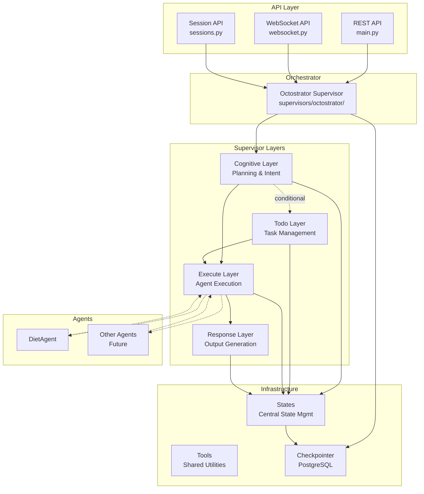
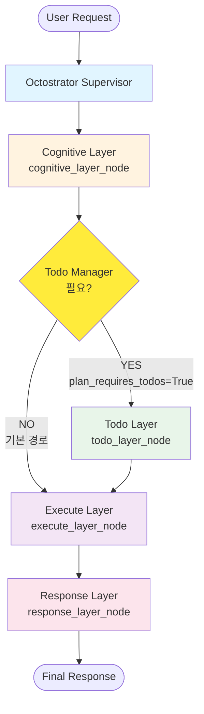
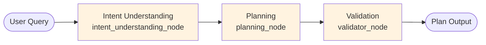
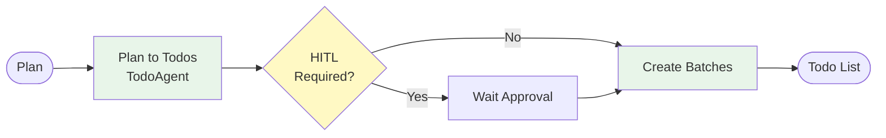
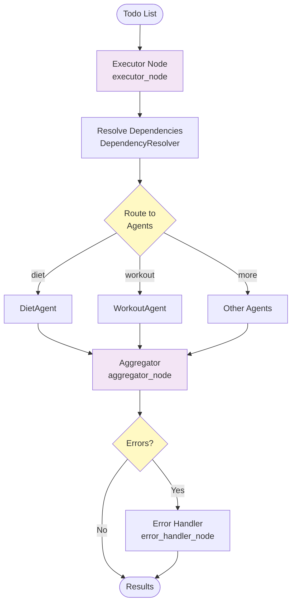
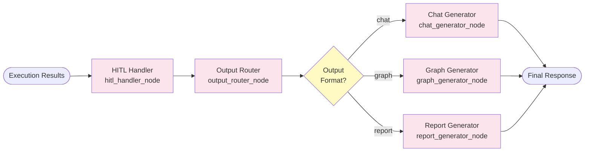
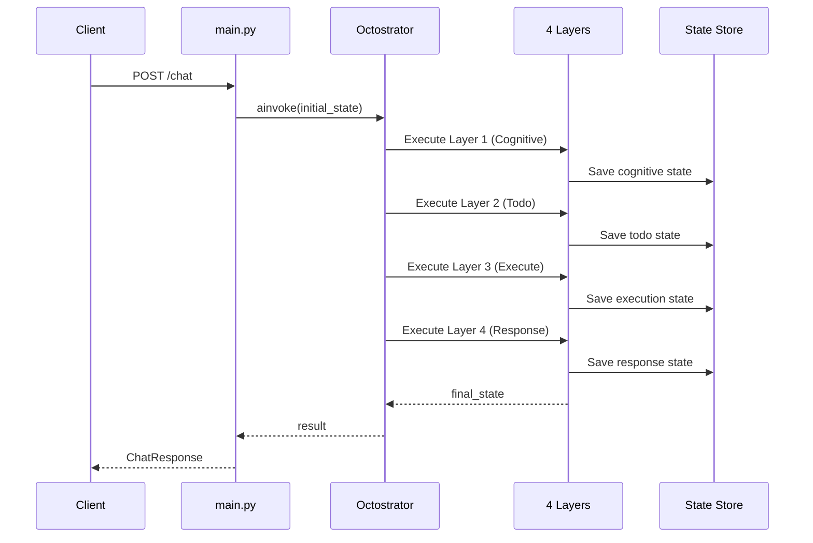
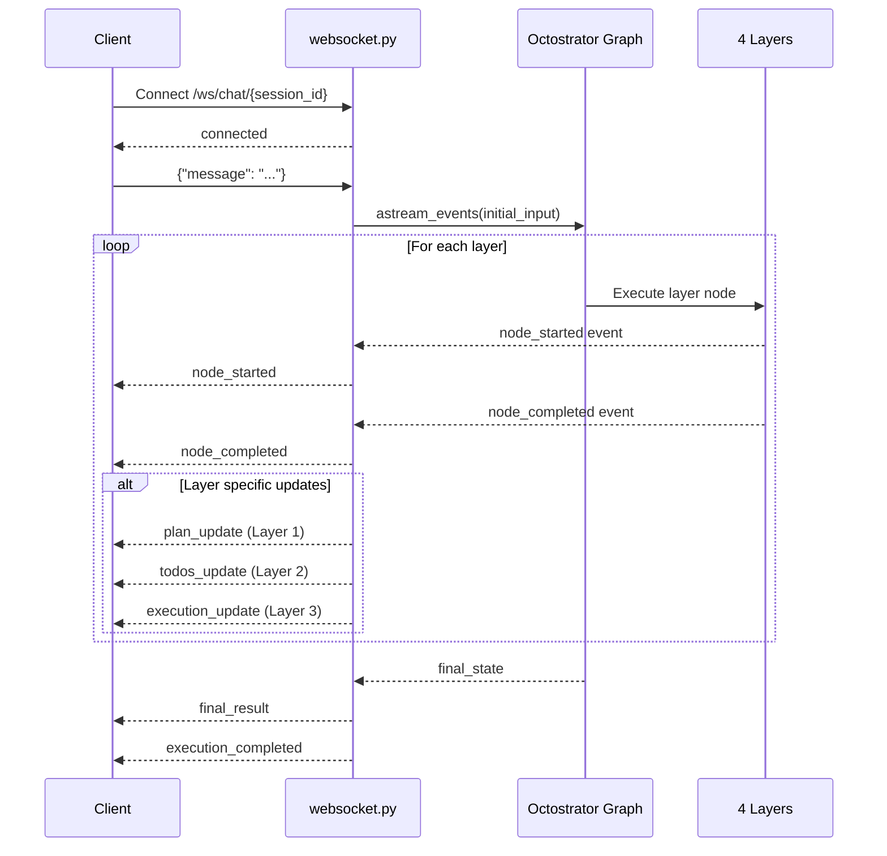
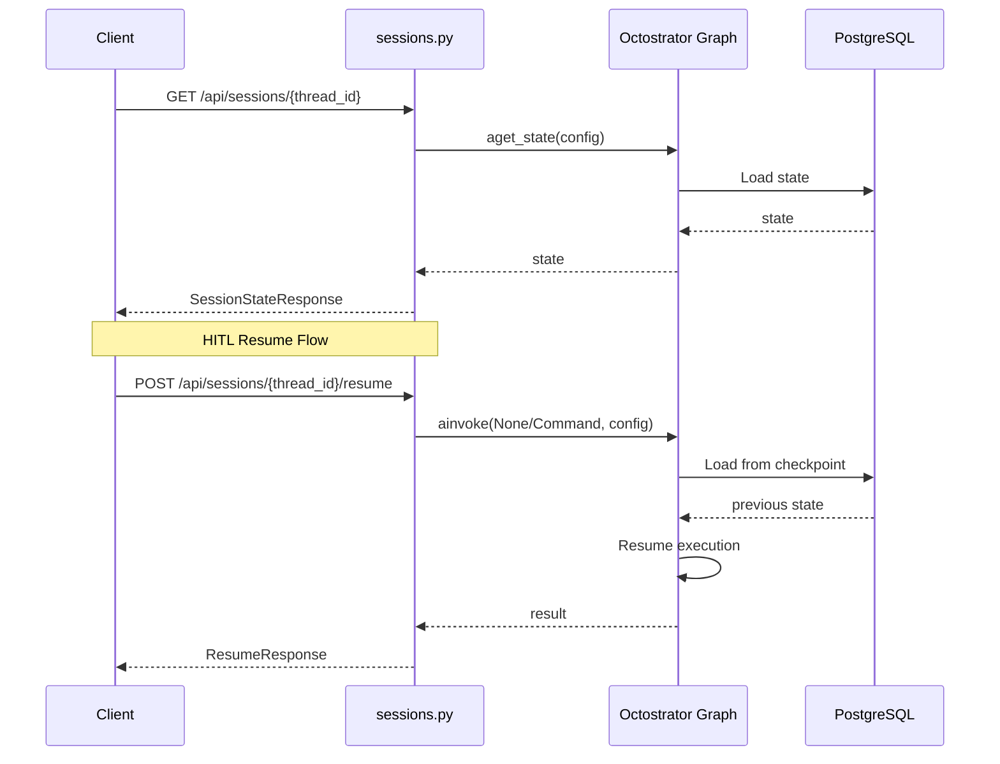
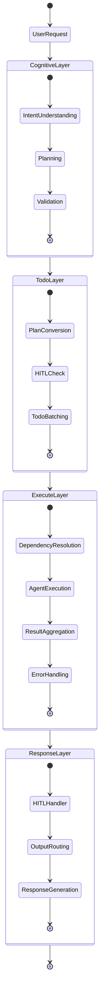

# AI PT Manager - System Architecture Flow

**Version:** 1.0
**Date:** 2025-11-05
**Author:** AI PT Manager Development Team

---

## 📋 Table of Contents

1. [Overall System Architecture](#overall-system-architecture)
2. [Octostrator Main Flow](#octostrator-main-flow)
3. [Layer Details](#layer-details)
4. [API Request Flow](#api-request-flow)
5. [Folder Structure](#folder-structure)

---

## 🏗️ Overall System Architecture



---

## 🔄 Octostrator Main Flow

**핵심 변경**: Todo Manager는 **필요시에만** 조건부로 실행됩니다.



### Todo Manager 호출 조건

Todo Manager는 다음 경우에만 실행됩니다:

1. **Cognitive Layer 요청**: `plan_requires_todos = True`
   - 복잡한 계획 → Todo 분할 필요
2. **Execute Layer 요청**: `need_todo_update = True`
   - 실행 중 추가 작업 발견
3. **사용자 API 요청**: `user_requested_todo_update = True`
   - 사용자가 직접 Todo 수정

### 중요 특징

- ✅ `state["todos"]`는 항상 존재 (초기값: `[]`)
- ✅ Todo Manager 노드 실행은 **선택적**
- ✅ 사용자는 API로 언제든 todos 수정 가능

### Octostrator Components

```
supervisors/octostrator/
├── octostrator_graph.py      # Main workflow graph
├── octostrator_nodes.py       # Layer execution nodes
├── octostrator_helpers.py     # OctostratorSupervisor class
└── __init__.py
```

---

## 📊 Layer Details

### Layer 1: Cognitive Layer

**Location:** `supervisors/cognitive/`



**Purpose:**
- Understand user intent
- Generate execution plan
- Validate plan feasibility

**State:** `CognitiveState`
```python
{
    "user_query": str,
    "user_intent": str,
    "plan": dict,
    "plan_valid": bool
}
```

---

### Layer 2: Todo Layer

**Location:** `supervisors/todo/`



**Purpose:**
- Convert plan to actionable todos
- Handle Human-in-the-Loop (HITL) approval
- Organize todos into execution batches

**State:** `TodoAgentState`
```python
{
    "plan": dict,
    "todos": list,
    "current_batch": dict,
    "requires_approval": bool
}
```

---

### Layer 3: Execute Layer

**Location:** `supervisors/execute/`



**Purpose:**
- Execute todos through specialized agents
- Resolve dependencies between tasks
- Aggregate results
- Handle errors

**State:** `ExecuteState`
```python
{
    "todos": list,
    "execution_tasks": list,
    "execution_results": dict,
    "completed": int,
    "failed": int,
    "success_rate": float
}
```

---

### Layer 4: Response Layer

**Location:** `supervisors/response/`



**Purpose:**
- Handle final HITL approval
- Route to appropriate output format
- Generate formatted response

**State:** `ResponseState`
```python
{
    "execution_results": dict,
    "output_format": str,  # "chat" | "graph" | "report"
    "final_response": str,
    "requires_approval": bool
}
```

---

## 🌐 API Request Flow

### REST API Flow



### WebSocket API Flow



### Session Management Flow



---

## 📁 Folder Structure

```
backend/app/octostrator/
│
├── supervisors/
│   ├── octostrator/              # Main Orchestrator
│   │   ├── octostrator_graph.py
│   │   ├── octostrator_nodes.py
│   │   ├── octostrator_helpers.py
│   │   └── __init__.py
│   │
│   ├── cognitive/                # Layer 1: Planning
│   │   ├── cognitive_graph.py
│   │   ├── cognitive_nodes.py
│   │   ├── cognitive_helpers.py
│   │   ├── cognitive_prompts.py
│   │   └── __init__.py
│   │
│   ├── todo/                     # Layer 2: Task Management
│   │   ├── todo_manager.py
│   │   └── __init__.py
│   │
│   ├── execute/                  # Layer 3: Execution
│   │   ├── execute_graph.py
│   │   ├── execute_nodes.py
│   │   ├── execute_helpers.py
│   │   ├── execute_prompts.py
│   │   └── __init__.py
│   │
│   └── response/                 # Layer 4: Output
│       ├── response_graph.py
│       ├── response_nodes.py
│       ├── response_helpers.py
│       ├── response_prompts.py
│       └── __init__.py
│
├── agents/                       # Domain Agents
│   ├── base/
│   │   ├── base_agent.py
│   │   ├── agent_registry.py
│   │   └── capabilities.py
│   ├── diet/
│   │   └── diet_agent.py
│   └── [other agents...]
│
├── states/                       # Central State Management
│   ├── cognitive_state.py
│   ├── todo_state.py
│   ├── execute_state.py
│   ├── response_state.py
│   ├── diet_state.py
│   └── __init__.py
│
├── tools/                        # Shared Tools
│   └── [tool implementations...]
│
├── checkpointer.py               # PostgreSQL Checkpointer
├── session.py                    # Session Management
└── test_octostrator.py           # Tests
```

---

## 🔑 Key Design Principles

### 1. **Separation of Concerns**
- Each layer has a specific responsibility
- Supervisors orchestrate, agents execute
- States are centrally managed

### 2. **Sequential Flow**
```
Cognitive → Todo → Execute → Response
```
- Each layer depends on the previous layer's output
- Clear data flow through state updates

### 3. **Modularity**
- Each supervisor is self-contained
- Can be tested independently
- Easy to add new agents or layers

### 4. **Checkpointing & Resume**
- Every state change is checkpointed
- Can resume from any point
- Supports HITL (Human-in-the-Loop)

### 5. **Consistent Naming**
- All files prefixed with folder name
- Example: `cognitive_graph.py`, `cognitive_nodes.py`
- Easy to identify which layer a file belongs to

---

## 📝 State Flow Example

### Complete Request Flow



### State Transitions

| Layer | Input State | Output State |
|-------|-------------|--------------|
| **Cognitive** | `user_query` | `plan`, `user_intent` |
| **Todo** | `plan` | `todos`, `current_batch` |
| **Execute** | `todos` | `execution_results`, `completed`, `failed` |
| **Response** | `execution_results` | `final_response` |

---

## 🚀 Execution Example

### Simple Request

```python
# User Request
request = {
    "message": "오늘 점심 식단 추천해줘"
}

# Octostrator processes through all layers
result = await octostrator_graph.ainvoke({
    "user_query": "오늘 점심 식단 추천해줘",
    "session_id": "user123",
    "output_format": "chat",
    # ... other initial state
})

# Layer 1: Cognitive
# → Intent: diet_recommendation
# → Plan: { goal: "점심 식단 추천", steps: [...] }

# Layer 2: Todo
# → Todos: [
#     { agent: "diet", task: "점심 메뉴 생성" },
#     { agent: "diet", task: "영양 정보 계산" }
#   ]

# Layer 3: Execute
# → DietAgent 실행
# → Results: { menu: "...", nutrition: "..." }

# Layer 4: Response
# → Format: chat
# → Final Response: "오늘 점심으로 ..."
```

---

## 📌 Summary

### Architecture Highlights

1. **4-Layer Sequential Architecture**
   - Clear separation of responsibilities
   - Predictable data flow
   - Easy to debug and test

2. **Main Orchestrator (Octostrator)**
   - Single entry point for all requests
   - Coordinates all 4 layers
   - Manages state transitions

3. **Centralized State Management**
   - All states in `states/` folder
   - Checkpointed in PostgreSQL
   - Supports resume and HITL

4. **Modular Agent System**
   - Agents are called by Execute Layer
   - Easy to add new agents
   - Registry-based discovery

5. **Multiple API Interfaces**
   - REST API for simple requests
   - WebSocket for real-time streaming
   - Session API for state management

---

**Last Updated:** 2025-11-05
**Version:** 1.0
**Maintainer:** AI PT Manager Development Team
