# AI PT Manager - System & Agent Flow Diagrams (Mermaid)

**프로젝트**: AI PT Manager - Todo Manager & State Management System
**날짜**: 2025-11-06
**버전**: v0.5.0

---

## 목차

1. [System Flow - 시스템 흐름](#1-system-flow---시스템-흐름)
2. [Agent Flow - 에이전트 흐름](#2-agent-flow---에이전트-흐름)
3. [Data Flow - 데이터 흐름](#3-data-flow---데이터-흐름)

---

## 1. System Flow - 시스템 흐름

### 1.1 전체 시스템 아키텍처

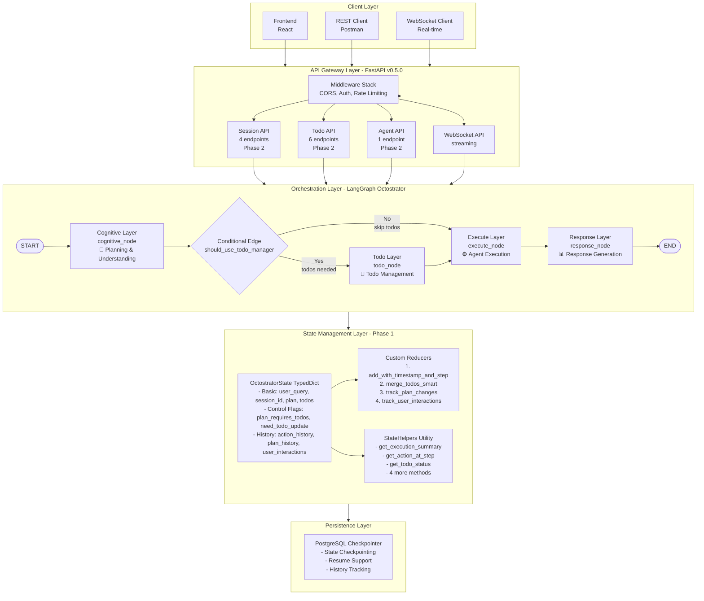

### 1.2 Conditional Todo Manager Flow - 조건부 실행

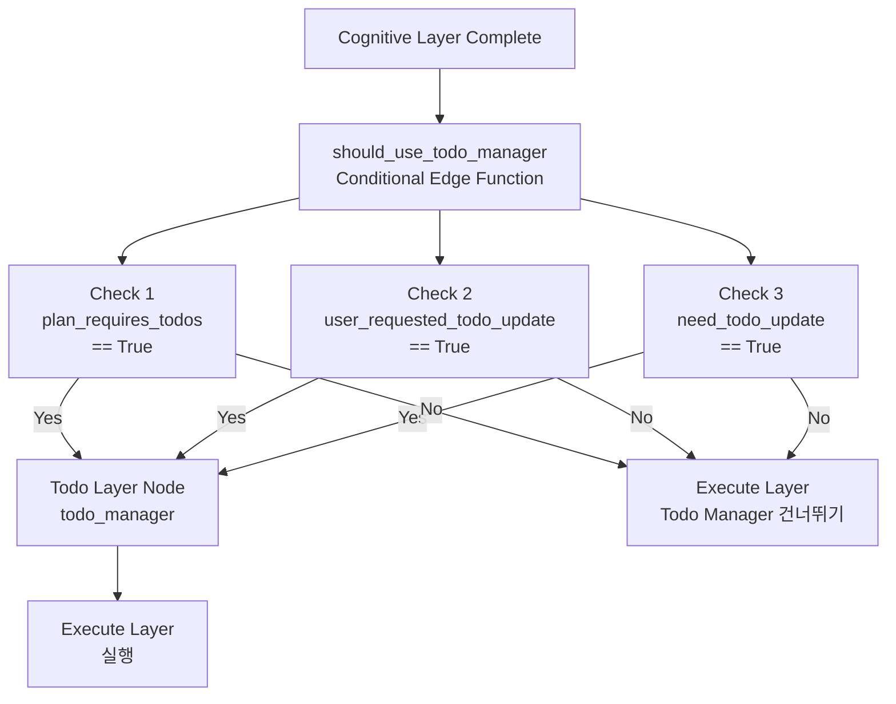

**설명**:
- **Check 1**: Cognitive가 복잡한 계획 생성 시 (예: steps > 1)
- **Check 2**: 사용자가 API로 Todo 수정 요청 시
- **Check 3**: Execute 중 새로운 Todo 필요 시

### 1.3 API Request Flow - API 요청 흐름

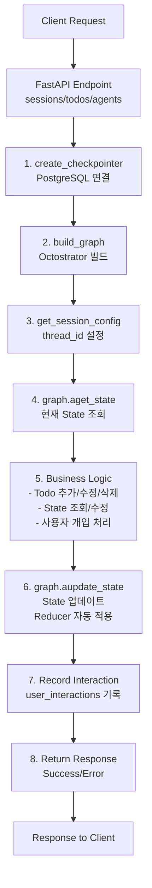

### 1.4 State Update Flow with Custom Reducers

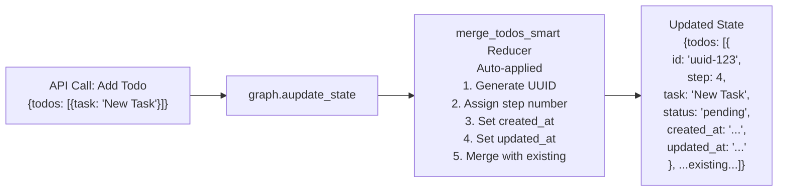

---

## 2. Agent Flow - 에이전트 흐름

### 2.1 Agent Hierarchy - 에이전트 계층 구조

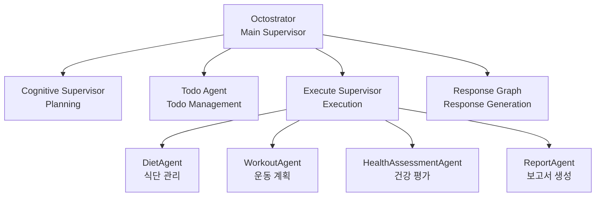

### 2.2 Cognitive Layer Agent Flow

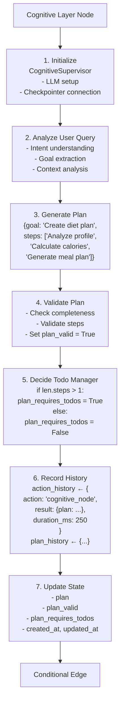

### 2.3 Todo Layer Agent Flow

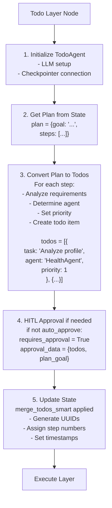

### 2.4 Execute Layer Agent Flow

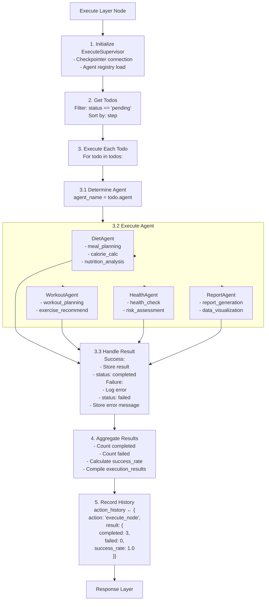

### 2.5 Response Layer Agent Flow

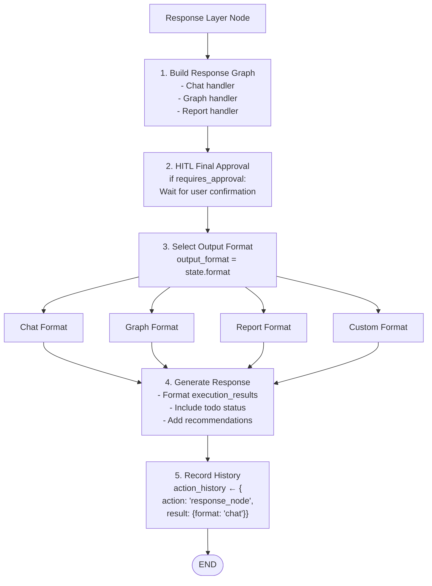

### 2.6 Domain Agent Collaboration Flow

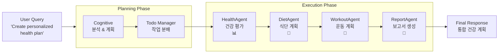

---

## 3. Data Flow - 데이터 흐름

### 3.1 State Evolution Through Layers

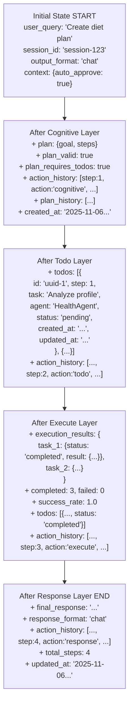

### 3.2 User Interaction Data Flow - 사용자 개입

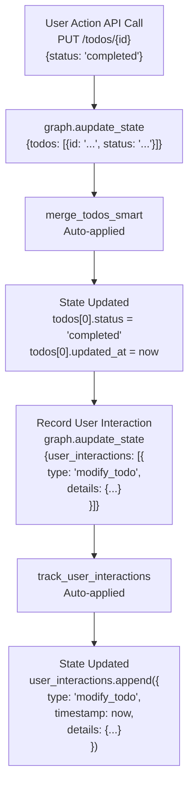

### 3.3 History Tracking Data Flow - 히스토리 추적

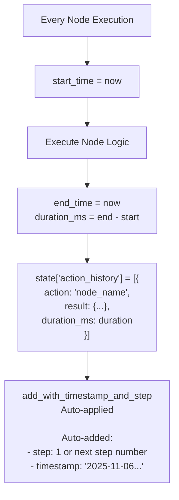

### 3.4 Complete Request-Response Data Flow

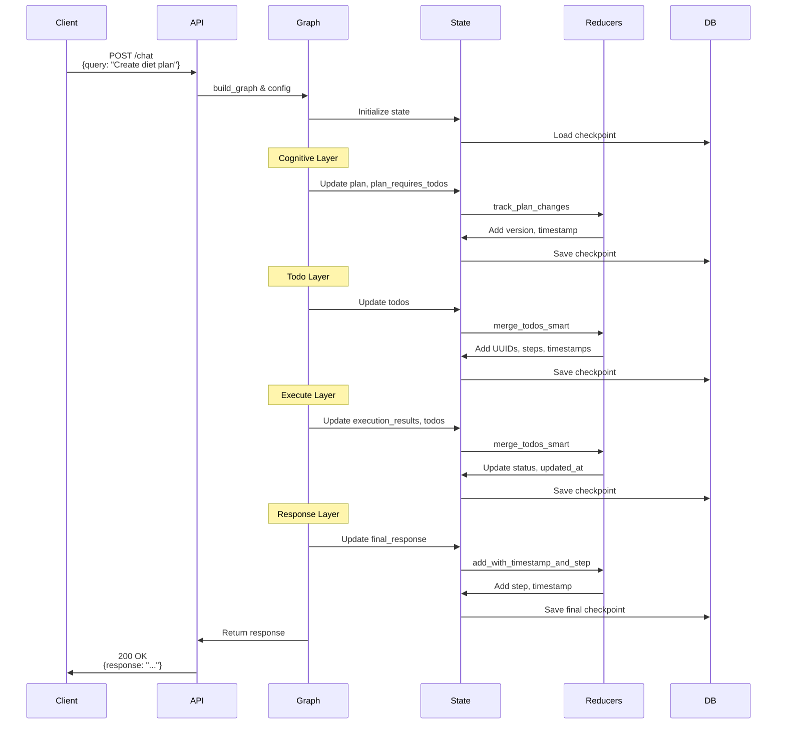

### 3.5 Interrupt & Resume Flow - 중단 및 재개

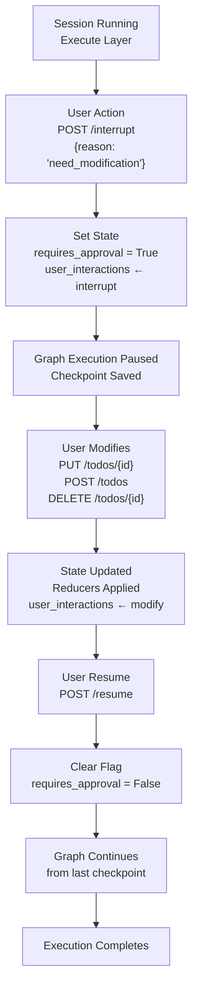

---

## 요약

### System Flow 핵심 포인트

1. **Client → API Gateway → Octostrator → State → DB**
2. **Conditional Todo Manager**: 필요시에만 실행하여 성능 최적화
3. **Custom Reducers**: State 업데이트 시 자동 적용
4. **StateHelpers**: State 조회 간소화

### Agent Flow 핵심 포인트

1. **4-Layer Architecture**: Cognitive → Todo → Execute → Response
2. **Hierarchical Agent System**: Octostrator → Layer Supervisors → Domain Agents
3. **Dynamic Agent Selection**: Todo의 agent 필드로 동적 선택
4. **Agent Capabilities**: 각 Agent의 특화된 기능

### Data Flow 핵심 포인트

1. **State Evolution**: 각 Layer를 거치며 State가 점진적으로 완성
2. **History Tracking**: 모든 작업 내역 자동 기록
3. **User Interaction**: API를 통한 사용자 개입 추적
4. **Automatic Metadata**: 타임스탬프, step 번호 자동 관리

---

**작성자**: AI PT Manager Development Team
**최종 업데이트**: 2025-11-06
**버전**: v0.5.0
