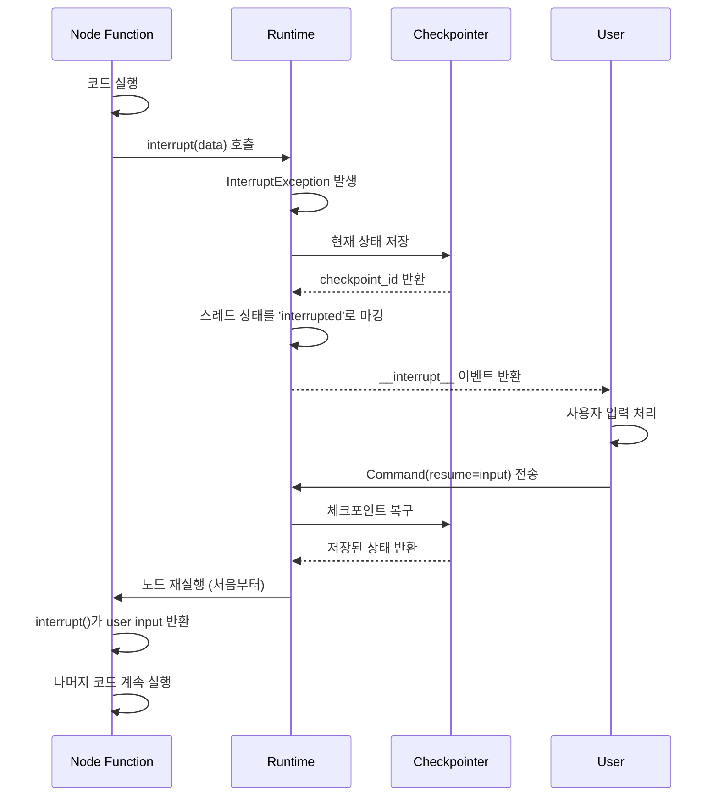

# LangGraph 1.0 기술 심화 가이드: Interrupt & Checkpointer

**작성일**: 2025-11-16
**대상**: Octostrator 개발자
**목적**: LangGraph 1.0의 핵심 메커니즘 상세 분석

---

## 목차

1. [Interrupt 메커니즘 심층 분석](#1-interrupt-메커니즘-심층-분석)
2. [AsyncPostgresSaver 내부 동작](#2-asyncpostgressaver-내부-동작)
3. [Command 객체와 상태 재개](#3-command-객체와-상태-재개)
4. [Multiple Interrupts 처리](#4-multiple-interrupts-처리)
5. [에러 처리 및 복구 전략](#5-에러-처리-및-복구-전략)
6. [성능 최적화 기법](#6-성능-최적화-기법)
7. [고급 패턴](#7-고급-패턴)

---

## 1. Interrupt 메커니즘 심층 분석

### 1.1 Interrupt의 생명주기



### 1.2 Interrupt 내부 구현 (개념적)

```python
# LangGraph 내부 동작 (단순화)

class GraphRuntime:
    async def execute_node(self, node_fn, state, config):
        try:
            # 노드 함수 실행
            result = await node_fn(state)
            return result

        except InterruptException as e:
            # 1. 현재 상태를 체크포인터에 저장
            checkpoint_id = await self.checkpointer.aput(
                config=config,
                checkpoint={
                    "state": state,
                    "node": node_fn.__name__,
                    "interrupt_data": e.data,
                    "timestamp": datetime.utcnow()
                },
                metadata={"status": "interrupted"}
            )

            # 2. 스레드 메타데이터 업데이트
            self.mark_thread_as_interrupted(config["thread_id"])

            # 3. Interrupt 이벤트 발생
            yield {
                "__interrupt__": {
                    "data": e.data,
                    "checkpoint_id": checkpoint_id,
                    "node": node_fn.__name__
                }
            }

            # 4. 실행 중단 (대기)
            return None

    async def resume_from_interrupt(self, command, config):
        # 1. 체크포인트에서 상태 복구
        checkpoint = await self.checkpointer.aget(config)

        # 2. resume 값을 준비
        resume_value = command.resume

        # 3. 중단된 노드를 재실행
        # interrupt() 함수가 resume_value를 반환하도록 설정
        self.set_resume_value(resume_value)

        # 4. 노드 재실행 (처음부터, 하지만 이전 노드들은 스킵)
        return await self.execute_node(
            checkpoint["node"],
            checkpoint["state"],
            config
        )
```

### 1.3 Interrupt 호출 시점 제어

```python
from langgraph.types import interrupt
from typing import Literal

def smart_validation_node(state):
    """조건에 따라 다른 interrupt 메시지 표시"""

    todos = state["todos"]

    # 조건 1: 너무 많은 TODO
    if len(todos) > 10:
        user_decision = interrupt({
            "type": "too_many_todos",
            "count": len(todos),
            "message": f"{len(todos)}개의 TODO가 생성되었습니다. 계속하시겠습니까?",
            "options": ["continue", "reduce", "cancel"]
        })

        if user_decision == "reduce":
            # 사용자가 줄이기를 선택
            reduced_todos = interrupt({
                "type": "edit_todos",
                "todos": todos,
                "message": "유지할 TODO를 선택하세요"
            })
            return {"todos": reduced_todos}

        elif user_decision == "cancel":
            return {"todos": [], "status": "cancelled"}

    # 조건 2: 고위험 작업
    high_risk_todos = [t for t in todos if t.get("risk") == "high"]
    if high_risk_todos:
        approval = interrupt({
            "type": "risk_approval",
            "high_risk_todos": high_risk_todos,
            "message": "위험도가 높은 작업이 포함되어 있습니다. 승인하시겠습니까?"
        })

        if not approval:
            # 고위험 작업 제거
            todos = [t for t in todos if t.get("risk") != "high"]
            return {"todos": todos}

    # 조건 3: 외부 리소스 필요
    external_deps = [t for t in todos if t.get("requires_external")]
    if external_deps:
        resources = interrupt({
            "type": "resource_check",
            "dependencies": external_deps,
            "message": "외부 리소스가 필요합니다. 확인해주세요."
        })

        # resources에 사용자가 제공한 리소스 정보 포함
        # 상태에 추가
        return {"external_resources": resources}

    return {"validation_passed": True}
```

### 1.4 Interrupt vs Static Breakpoints 비교

| 기능 | Interrupt (동적) | Breakpoint (정적) |
|------|-----------------|------------------|
| **설정 위치** | 노드 함수 내부 코드 | 그래프 컴파일 시 또는 config |
| **조건부 실행** | `if` 문으로 자유롭게 제어 | 불가능 (항상 중단) |
| **데이터 전달** | interrupt(data)로 임의 데이터 | 현재 상태만 |
| **재개 방법** | Command(resume=값) | 단순 재실행 (입력 없음) |
| **사용 사례** | 승인, 편집, 동적 검증 | 디버깅, 단계별 실행 |
| **복잡도** | 높음 | 낮음 |

```python
# Static Breakpoint 예제
from langgraph.graph import StateGraph

builder = StateGraph(State)
builder.add_node("process", process_node)

# 컴파일 시 breakpoint 설정
graph = builder.compile(
    checkpointer=checkpointer,
    interrupt_before=["process"]  # process 노드 실행 전 항상 중단
)

# 또는 런타임에 설정
result = await graph.ainvoke(
    input_data,
    config={
        "configurable": {"thread_id": "123"},
        "interrupt_before": ["process"]
    }
)
```

---

## 2. AsyncPostgresSaver 내부 동작

### 2.1 테이블 스키마 상세

```sql
-- 체크포인트 메인 테이블
CREATE TABLE checkpoints (
    -- 스레드 식별자 (세션 구분)
    thread_id TEXT NOT NULL,

    -- 네임스페이스 (서브그래프 구분, 기본값 '')
    checkpoint_ns TEXT NOT NULL DEFAULT '',

    -- 체크포인트 고유 ID (UUID 형식)
    checkpoint_id TEXT NOT NULL,

    -- 부모 체크포인트 ID (버전 체인)
    parent_checkpoint_id TEXT,

    -- 체크포인트 타입 (메타데이터)
    type TEXT,

    -- 실제 상태 데이터 (JSON)
    checkpoint JSONB NOT NULL,

    -- 메타데이터 (커스텀 정보)
    metadata JSONB NOT NULL DEFAULT '{}',

    PRIMARY KEY (thread_id, checkpoint_ns, checkpoint_id)
);

-- 체크포인트 쓰기 작업 (pending writes)
CREATE TABLE checkpoint_writes (
    thread_id TEXT NOT NULL,
    checkpoint_ns TEXT NOT NULL DEFAULT '',
    checkpoint_id TEXT NOT NULL,

    -- 작업 ID (병렬 작업 구분)
    task_id TEXT NOT NULL,

    -- 작업 인덱스 (순서)
    idx INTEGER NOT NULL,

    -- 채널 이름 (상태 key)
    channel TEXT NOT NULL,

    -- 쓰기 타입
    type TEXT,

    -- 값 (JSON)
    value JSONB,

    PRIMARY KEY (thread_id, checkpoint_ns, checkpoint_id, task_id, idx)
);

-- 인덱스 (성능 최적화)
CREATE INDEX idx_checkpoints_thread_id ON checkpoints(thread_id);
CREATE INDEX idx_checkpoints_parent ON checkpoints(parent_checkpoint_id);
CREATE INDEX idx_checkpoint_writes_checkpoint ON checkpoint_writes(thread_id, checkpoint_ns, checkpoint_id);
```

### 2.2 체크포인트 저장 과정

```python
from langgraph.checkpoint.postgres.aio import AsyncPostgresSaver
from typing import Dict, Any

class CheckpointSaveProcess:
    """체크포인트 저장 과정 상세"""

    async def save_checkpoint_detailed(
        self,
        checkpointer: AsyncPostgresSaver,
        thread_id: str,
        state: Dict[str, Any],
        metadata: Dict[str, Any]
    ):
        """
        체크포인트 저장의 내부 과정
        """

        # 1. 체크포인트 ID 생성 (UUID)
        import uuid
        checkpoint_id = str(uuid.uuid4())

        # 2. 부모 체크포인트 조회 (버전 체인)
        parent_checkpoint = await checkpointer.aget({
            "configurable": {"thread_id": thread_id}
        })
        parent_id = parent_checkpoint.checkpoint_id if parent_checkpoint else None

        # 3. 체크포인트 데이터 구조화
        checkpoint_data = {
            "v": 1,  # 스키마 버전
            "id": checkpoint_id,
            "ts": datetime.utcnow().isoformat(),
            "channel_values": {
                # 상태의 각 키를 개별 채널로 저장
                "messages": state.get("messages", []),
                "todos": state.get("todos", []),
                "user_query": state.get("user_query", ""),
                # ...
            },
            "channel_versions": {
                # 각 채널의 버전
                "messages": 1,
                "todos": 1,
                # ...
            },
            "versions_seen": {
                # 이 체크포인트가 본 다른 채널의 버전
            }
        }

        # 4. PostgreSQL에 저장
        await checkpointer.aput(
            config={
                "configurable": {
                    "thread_id": thread_id,
                    "checkpoint_ns": ""
                }
            },
            checkpoint=checkpoint_data,
            metadata=metadata,
            new_versions={}
        )

        return checkpoint_id
```

### 2.3 체크포인트 복구 과정

```python
async def restore_checkpoint_detailed(
    checkpointer: AsyncPostgresSaver,
    thread_id: str,
    checkpoint_id: str = None
):
    """체크포인트 복구의 내부 과정"""

    # 1. 설정 준비
    config = {
        "configurable": {
            "thread_id": thread_id,
            "checkpoint_ns": "",
            "checkpoint_id": checkpoint_id  # None이면 최신 체크포인트
        }
    }

    # 2. 체크포인트 조회
    checkpoint = await checkpointer.aget(config)

    if not checkpoint:
        raise ValueError(f"Checkpoint not found for thread {thread_id}")

    # 3. 상태 재구성
    restored_state = {
        "messages": checkpoint.checkpoint["channel_values"]["messages"],
        "todos": checkpoint.checkpoint["channel_values"]["todos"],
        "user_query": checkpoint.checkpoint["channel_values"]["user_query"],
        # ...
    }

    # 4. 메타데이터 복구
    metadata = checkpoint.metadata

    # 5. 다음 실행할 노드 정보
    next_node = checkpoint.pending_writes[0]["channel"] if checkpoint.pending_writes else None

    return {
        "state": restored_state,
        "metadata": metadata,
        "next_node": next_node,
        "checkpoint_id": checkpoint.checkpoint_id
    }
```

### 2.4 체크포인트 히스토리 조회

```python
async def get_checkpoint_history(
    checkpointer: AsyncPostgresSaver,
    thread_id: str,
    limit: int = 10
):
    """특정 스레드의 체크포인트 히스토리"""

    config = {
        "configurable": {
            "thread_id": thread_id,
            "checkpoint_ns": ""
        }
    }

    history = []
    count = 0

    async for checkpoint in checkpointer.alist(config, limit=limit):
        history.append({
            "checkpoint_id": checkpoint.checkpoint_id,
            "parent_id": checkpoint.parent_checkpoint_id,
            "created_at": checkpoint.checkpoint["ts"],
            "metadata": checkpoint.metadata,
            "state_summary": {
                "num_messages": len(checkpoint.checkpoint["channel_values"].get("messages", [])),
                "num_todos": len(checkpoint.checkpoint["channel_values"].get("todos", [])),
            }
        })

        count += 1
        if count >= limit:
            break

    return history
```

---

## 3. Command 객체와 상태 재개

### 3.1 Command 객체 구조

```python
from langgraph.types import Command
from typing import Any, Dict

# Command는 다음과 같은 구조
class Command:
    """
    그래프 재개를 위한 명령 객체

    Attributes:
        resume: interrupt()의 반환값이 될 데이터
        update: (옵션) 상태를 업데이트할 추가 데이터
        goto: (옵션) 특정 노드로 이동
    """

    def __init__(
        self,
        resume: Any = None,
        update: Dict[str, Any] = None,
        goto: str = None
    ):
        self.resume = resume
        self.update = update or {}
        self.goto = goto

# 사용 예제
command1 = Command(resume="사용자 승인")
command2 = Command(
    resume={"action": "edit", "todos": [...]},
    update={"user_feedback": "수정됨"}
)
command3 = Command(
    resume=None,
    goto="specific_node"  # 특정 노드로 점프
)
```

### 3.2 재개 시나리오별 패턴

#### 시나리오 1: 단순 승인/거부

```python
# 노드 함수
def approval_node(state):
    if state["needs_approval"]:
        approved = interrupt("승인하시겠습니까?")

        if approved:
            return {"status": "approved"}
        else:
            return {"status": "rejected", "todos": []}

    return state

# 클라이언트 코드
# 1. 초기 실행
result1 = await graph.ainvoke(initial_state, config)
# -> interrupt 발생

# 2. 승인으로 재개
result2 = await graph.ainvoke(
    Command(resume=True),  # approved = True
    config
)

# 3. 거부로 재개
result3 = await graph.ainvoke(
    Command(resume=False),  # approved = False
    config
)
```

#### 시나리오 2: 데이터 편집

```python
# 노드 함수
def edit_node(state):
    if state["allow_edit"]:
        edited_data = interrupt({
            "type": "edit_request",
            "current_data": state["todos"],
            "instructions": "TODO를 수정하세요"
        })

        # edited_data는 사용자가 수정한 TODO 리스트
        return {"todos": edited_data, "edited": True}

    return state

# 클라이언트 코드
# 1. 초기 실행
result = await graph.ainvoke(initial_state, config)
# -> interrupt 발생, result에 current_data 포함

# 2. 사용자가 데이터 수정
edited_todos = [
    {"id": "1", "title": "수정된 제목", ...},
    # ...
]

# 3. 수정된 데이터로 재개
result = await graph.ainvoke(
    Command(resume=edited_todos),
    config
)
```

#### 시나리오 3: 상태 업데이트와 함께 재개

```python
# 노드 함수
def complex_node(state):
    user_choice = interrupt("옵션을 선택하세요")

    # user_choice에 따라 처리
    if user_choice == "option_a":
        # ...
        pass

    return {"choice": user_choice}

# 클라이언트 코드
# 재개하면서 추가 상태도 업데이트
result = await graph.ainvoke(
    Command(
        resume="option_a",
        update={
            "user_notes": "사용자가 추가한 메모",
            "timestamp": datetime.utcnow().isoformat()
        }
    ),
    config
)
# 상태에 choice="option_a", user_notes="...", timestamp="..." 모두 포함
```

### 3.3 재개 시 노드 재실행 메커니즘

```python
# 중요: interrupt() 이후 노드는 처음부터 다시 실행됨

def multi_step_node(state):
    print("Step 1: 초기화")
    data = expensive_computation()  # 비용이 큰 작업

    print("Step 2: 검증")
    if needs_user_confirmation(data):
        user_input = interrupt({"data": data, "message": "확인 필요"})

        print("Step 3: 재개 후 - 이 부분만 실행되는게 아니라...")
        # 노드가 처음부터 다시 실행되므로 Step 1도 다시 실행됨!

    print("Step 4: 완료")
    return {"result": data}

# 해결책: 상태를 사용하여 이미 실행된 단계 스킵
def optimized_multi_step_node(state):
    # 이미 계산된 데이터가 있으면 재사용
    if "computed_data" not in state:
        print("Step 1: 초기화 (최초 1회만)")
        data = expensive_computation()
        state["computed_data"] = data
    else:
        print("Step 1: 스킵 (캐시 사용)")
        data = state["computed_data"]

    if needs_user_confirmation(data) and not state.get("confirmed"):
        user_input = interrupt({"data": data})
        # 재개 후 이 블록은 스킵됨 (confirmed=True로 설정)
        return {"confirmed": True}

    print("Step 4: 완료")
    return {"result": data}
```

---

## 4. Multiple Interrupts 처리

### 4.1 순차적 Multiple Interrupts

```python
def sequential_interrupts_node(state):
    """여러 단계에서 사용자 입력 받기"""

    # 첫 번째 interrupt
    step1_input = interrupt({
        "step": 1,
        "message": "프로젝트 이름을 입력하세요"
    })

    # 두 번째 interrupt
    step2_input = interrupt({
        "step": 2,
        "message": "프로젝트 설명을 입력하세요",
        "project_name": step1_input  # 이전 입력 참조 가능
    })

    # 세 번째 interrupt
    step3_input = interrupt({
        "step": 3,
        "message": "우선순위를 선택하세요",
        "project_name": step1_input,
        "description": step2_input
    })

    return {
        "project": {
            "name": step1_input,
            "description": step2_input,
            "priority": step3_input
        }
    }

# 클라이언트 처리
# 첫 실행 - step 1에서 중단
r1 = await graph.ainvoke(initial_state, config)
# r1["__interrupt__"]["step"] == 1

# 재개 1 - step 2에서 중단
r2 = await graph.ainvoke(Command(resume="My Project"), config)
# r2["__interrupt__"]["step"] == 2

# 재개 2 - step 3에서 중단
r3 = await graph.ainvoke(Command(resume="프로젝트 설명"), config)
# r3["__interrupt__"]["step"] == 3

# 최종 재개 - 완료
r4 = await graph.ainvoke(Command(resume="high"), config)
# r4에 최종 project 객체 포함
```

### 4.2 Resume List 메커니즘

LangGraph는 내부적으로 **resume list**를 유지합니다:

```python
# 내부 동작 (개념적)
class TaskContext:
    def __init__(self):
        self.resume_values = []  # 재개 값 리스트
        self.interrupt_index = 0  # 현재 interrupt 인덱스

    def interrupt(self, data):
        # resume_values에 해당 인덱스의 값이 있는지 확인
        if self.interrupt_index < len(self.resume_values):
            # 이미 제공된 값이 있으면 반환 (재실행 시)
            value = self.resume_values[self.interrupt_index]
            self.interrupt_index += 1
            return value
        else:
            # 값이 없으면 실제로 중단
            raise InterruptException(data)

# 예시
def node_with_multiple_interrupts(state):
    # 첫 실행: interrupt_index=0, resume_values=[]
    val1 = interrupt("첫 번째")  # -> 중단, InterruptException

    # 첫 재개: interrupt_index=0, resume_values=["A"]
    val1 = interrupt("첫 번째")  # -> "A" 반환, interrupt_index=1
    val2 = interrupt("두 번째")  # -> 중단, InterruptException

    # 두 번째 재개: interrupt_index=0, resume_values=["A", "B"]
    val1 = interrupt("첫 번째")  # -> "A" 반환
    val2 = interrupt("두 번째")  # -> "B" 반환
    # 완료

    return {"val1": val1, "val2": val2}
```

### 4.3 조건부 Multiple Interrupts

```python
def conditional_multi_interrupt_node(state):
    """조건에 따라 다른 수의 interrupt 발생"""

    todos = state["todos"]

    # 조건 1: 일반 승인
    approved = interrupt({"type": "approval", "todos": todos})

    if not approved:
        return {"status": "rejected"}

    # 조건 2: 고위험 항목이 있으면 추가 확인
    high_risk = [t for t in todos if t["priority"] == "high"]
    if high_risk:
        high_risk_approved = interrupt({
            "type": "high_risk_approval",
            "todos": high_risk
        })

        if not high_risk_approved:
            # 고위험 항목 제거
            todos = [t for t in todos if t["priority"] != "high"]

    # 조건 3: 외부 리소스 필요 시 추가 확인
    if state.get("needs_external_resources"):
        resources = interrupt({
            "type": "resource_provision",
            "required": state["required_resources"]
        })
        state["provided_resources"] = resources

    return {"todos": todos, "status": "approved"}

# 주의: 조건부 interrupt는 재실행 시 문제 발생 가능
# 예: 첫 실행에서 3개 interrupt, 재개 후 조건 변경으로 2개만 interrupt
# -> resume_values[2]가 사용되지 않음

# 해결: 상태를 명확히 하여 일관성 유지
def safe_conditional_interrupt_node(state):
    # 각 interrupt에 고유 key 사용
    if not state.get("approval_done"):
        approved = interrupt({"key": "approval", "todos": state["todos"]})
        if not approved:
            return {"status": "rejected"}
        state["approval_done"] = True

    if not state.get("high_risk_done") and has_high_risk(state["todos"]):
        high_risk_approved = interrupt({"key": "high_risk"})
        if not high_risk_approved:
            state["todos"] = remove_high_risk(state["todos"])
        state["high_risk_done"] = True

    return state
```

---

## 5. 에러 처리 및 복구 전략

### 5.1 Interrupt 중 에러 처리

```python
from langgraph.types import interrupt
from typing import Optional
import asyncio

async def robust_interrupt_node(state):
    """안전한 interrupt 처리"""

    max_retries = 3
    retry_count = state.get("interrupt_retry_count", 0)

    try:
        # Timeout 설정
        async with asyncio.timeout(300):  # 5분 타임아웃
            user_input = interrupt({
                "type": "user_input_request",
                "data": state["data"],
                "retry_count": retry_count
            })

            # 입력 검증
            if not validate_user_input(user_input):
                raise ValueError("Invalid user input")

            return {
                "user_input": user_input,
                "interrupt_retry_count": 0  # 성공 시 리셋
            }

    except asyncio.TimeoutError:
        # 타임아웃 처리
        if retry_count < max_retries:
            # 재시도
            return {
                "interrupt_retry_count": retry_count + 1,
                "error": "Timeout, retrying..."
            }
        else:
            # 최대 재시도 초과
            return {
                "status": "failed",
                "error": "Max retries exceeded"
            }

    except ValueError as e:
        # 검증 오류 - 사용자에게 다시 요청
        return {
            "interrupt_retry_count": retry_count + 1,
            "error": str(e),
            "validation_error": True
        }

    except Exception as e:
        # 기타 예외
        return {
            "status": "error",
            "error": str(e)
        }
```

### 5.2 체크포인트 복구 실패 처리

```python
async def safe_checkpoint_restore(
    graph,
    thread_id: str,
    checkpoint_id: Optional[str] = None
):
    """안전한 체크포인트 복구"""

    try:
        config = {
            "configurable": {
                "thread_id": thread_id,
                "checkpoint_id": checkpoint_id
            }
        }

        state = await graph.aget_state(config)

        if not state:
            raise ValueError(f"No checkpoint found for thread {thread_id}")

        return state

    except Exception as e:
        print(f"Checkpoint restore failed: {e}")

        # Fallback 1: 최신 체크포인트 시도
        try:
            fallback_config = {
                "configurable": {
                    "thread_id": thread_id
                }
            }
            state = await graph.aget_state(fallback_config)
            if state:
                return state
        except:
            pass

        # Fallback 2: 체크포인트 히스토리 조회 및 가장 최근 유효한 것 사용
        checkpointer = await CheckpointerManager.get_checkpointer()
        async for checkpoint in checkpointer.alist(fallback_config, limit=10):
            try:
                # 각 체크포인트 검증
                if validate_checkpoint(checkpoint):
                    return checkpoint
            except:
                continue

        # 복구 불가능
        raise RuntimeError(f"Unable to restore any valid checkpoint for thread {thread_id}")

def validate_checkpoint(checkpoint):
    """체크포인트 유효성 검증"""
    required_keys = ["channel_values", "ts"]
    return all(key in checkpoint.checkpoint for key in required_keys)
```

### 5.3 부분 실패 복구 (Partial Failure Recovery)

```python
def resilient_todo_generation_node(state):
    """부분 실패를 허용하는 TODO 생성"""

    user_query = state["user_query"]
    generated_todos = []
    failed_items = []

    # TODO 생성 (여러 시도)
    for attempt in range(3):
        try:
            todos = llm_generate_todos(user_query)

            for todo in todos:
                try:
                    # 각 TODO 검증
                    validated_todo = validate_and_enrich_todo(todo)
                    generated_todos.append(validated_todo)

                except Exception as e:
                    # 개별 TODO 실패는 기록하고 계속
                    failed_items.append({
                        "todo": todo,
                        "error": str(e)
                    })

            # 최소 1개 이상 성공하면 break
            if generated_todos:
                break

        except Exception as e:
            # 전체 생성 실패
            if attempt == 2:  # 마지막 시도
                # 사용자 개입 요청
                user_decision = interrupt({
                    "type": "generation_failed",
                    "error": str(e),
                    "failed_items": failed_items,
                    "options": ["retry", "manual_input", "cancel"]
                })

                if user_decision == "manual_input":
                    manual_todos = interrupt({
                        "type": "manual_todo_input",
                        "message": "TODO를 직접 입력하세요"
                    })
                    generated_todos = manual_todos
                    break

                elif user_decision == "cancel":
                    return {"status": "cancelled"}

    return {
        "todos": generated_todos,
        "failed_items": failed_items,
        "generation_success": len(generated_todos) > 0
    }
```

---

## 6. 성능 최적화 기법

### 6.1 체크포인트 저장 최적화

```python
# 문제: 매 노드마다 체크포인트 저장 -> 느림

# 해결 1: 선택적 체크포인트
from langgraph.checkpoint.base import BaseCheckpointSaver

class SelectiveCheckpointer(BaseCheckpointSaver):
    """중요한 노드에서만 체크포인트 저장"""

    def __init__(self, base_checkpointer, save_on_nodes: list):
        self.base = base_checkpointer
        self.save_on_nodes = set(save_on_nodes)

    async def aput(self, config, checkpoint, metadata, new_versions):
        # 현재 노드 확인
        current_node = metadata.get("current_node")

        if current_node in self.save_on_nodes or metadata.get("force_save"):
            # 중요 노드이거나 강제 저장
            return await self.base.aput(config, checkpoint, metadata, new_versions)
        else:
            # 스킵
            return None

# 사용
checkpointer = SelectiveCheckpointer(
    base_checkpointer=AsyncPostgresSaver.from_conn_string(DB_URI),
    save_on_nodes=["validate", "save_todos"]  # 이 노드들에서만 저장
)

# 해결 2: 배치 저장
class BatchCheckpointer:
    """여러 체크포인트를 모아서 한 번에 저장"""

    def __init__(self, base_checkpointer, batch_size=5):
        self.base = base_checkpointer
        self.batch_size = batch_size
        self.pending = []

    async def aput(self, config, checkpoint, metadata, new_versions):
        self.pending.append((config, checkpoint, metadata, new_versions))

        if len(self.pending) >= self.batch_size:
            await self.flush()

        return checkpoint["id"]

    async def flush(self):
        """펜딩 중인 체크포인트 모두 저장"""
        if not self.pending:
            return

        # PostgreSQL COPY 또는 bulk insert 사용
        async with self.base.conn.cursor() as cur:
            await cur.executemany(
                """
                INSERT INTO checkpoints (thread_id, checkpoint_id, checkpoint, metadata)
                VALUES (%s, %s, %s, %s)
                """,
                [
                    (
                        cfg["configurable"]["thread_id"],
                        chk["id"],
                        json.dumps(chk),
                        json.dumps(meta)
                    )
                    for cfg, chk, meta, _ in self.pending
                ]
            )

        self.pending.clear()
```

### 6.2 상태 압축

```python
from typing import Any, Dict
import json
import zlib
import base64

def compress_state(state: Dict[str, Any]) -> str:
    """상태 압축 (체크포인트 크기 감소)"""
    json_str = json.dumps(state)
    compressed = zlib.compress(json_str.encode())
    return base64.b64encode(compressed).decode()

def decompress_state(compressed: str) -> Dict[str, Any]:
    """압축된 상태 복원"""
    compressed_bytes = base64.b64decode(compressed)
    json_str = zlib.decompress(compressed_bytes).decode()
    return json.loads(json_str)

# 체크포인터에 통합
class CompressedCheckpointer(AsyncPostgresSaver):
    async def aput(self, config, checkpoint, metadata, new_versions):
        # 상태 압축
        compressed_checkpoint = {
            **checkpoint,
            "channel_values": compress_state(checkpoint["channel_values"])
        }

        return await super().aput(config, compressed_checkpoint, metadata, new_versions)

    async def aget(self, config):
        checkpoint = await super().aget(config)

        if checkpoint:
            # 압축 해제
            checkpoint.checkpoint["channel_values"] = decompress_state(
                checkpoint.checkpoint["channel_values"]
            )

        return checkpoint
```

### 6.3 캐싱 전략

```python
from functools import lru_cache
from datetime import datetime, timedelta

class CachedGraphExecutor:
    """LLM 호출 결과 캐싱"""

    def __init__(self):
        self.cache = {}
        self.cache_ttl = timedelta(hours=1)

    def get_cache_key(self, query: str, model: str) -> str:
        """캐시 키 생성"""
        import hashlib
        return hashlib.md5(f"{query}:{model}".encode()).hexdigest()

    async def cached_llm_call(self, llm, query: str):
        """캐시된 LLM 호출"""
        cache_key = self.get_cache_key(query, llm.model_name)

        # 캐시 확인
        if cache_key in self.cache:
            cached_item = self.cache[cache_key]
            if datetime.utcnow() - cached_item["timestamp"] < self.cache_ttl:
                print(f"Cache hit for query: {query[:50]}...")
                return cached_item["result"]

        # 캐시 미스 - LLM 호출
        result = await llm.ainvoke(query)

        # 캐시 저장
        self.cache[cache_key] = {
            "result": result,
            "timestamp": datetime.utcnow()
        }

        return result

# 사용
cache_executor = CachedGraphExecutor()

async def optimized_parse_node(state):
    result = await cache_executor.cached_llm_call(
        llm,
        state["user_query"]
    )
    return {"messages": [result]}
```

---

## 7. 고급 패턴

### 7.1 Nested Interrupts (중첩된 중단)

```python
def nested_interrupt_workflow(state):
    """중첩된 사용자 확인 플로우"""

    # 레벨 1: 전체 계획 승인
    plan_approved = interrupt({
        "level": 1,
        "type": "plan_approval",
        "plan": state["plan"]
    })

    if not plan_approved:
        return {"status": "cancelled"}

    # 레벨 2: 각 단계별 상세 승인
    approved_steps = []
    for step in state["plan"]["steps"]:
        step_approved = interrupt({
            "level": 2,
            "type": "step_approval",
            "step": step,
            "approved_so_far": approved_steps
        })

        if step_approved:
            approved_steps.append(step)

            # 레벨 3: 고위험 단계의 경우 추가 세부 승인
            if step.get("risk") == "high":
                details_approved = interrupt({
                    "level": 3,
                    "type": "risk_detail_approval",
                    "step": step,
                    "details": step["risk_details"]
                })

                if not details_approved:
                    approved_steps.pop()  # 단계 제거

    return {
        "approved_steps": approved_steps,
        "total_steps": len(state["plan"]["steps"]),
        "approval_rate": len(approved_steps) / len(state["plan"]["steps"])
    }
```

### 7.2 Time-based Interrupt (시간 기반 중단)

```python
import asyncio
from datetime import datetime, timedelta

async def time_sensitive_node(state):
    """시간 제한이 있는 사용자 입력"""

    timeout_seconds = 60  # 1분
    start_time = datetime.utcnow()

    try:
        # 타임아웃과 함께 interrupt
        user_input = await asyncio.wait_for(
            interrupt({
                "type": "time_sensitive",
                "deadline": (start_time + timedelta(seconds=timeout_seconds)).isoformat(),
                "message": "60초 내에 응답해주세요"
            }),
            timeout=timeout_seconds
        )

        return {"user_input": user_input, "responded_in_time": True}

    except asyncio.TimeoutError:
        # 타임아웃 - 기본 동작
        return {
            "user_input": None,
            "responded_in_time": False,
            "default_action_taken": True
        }
```

### 7.3 Conditional Routing after Interrupt

```python
def interrupt_with_routing(state):
    """Interrupt 결과에 따라 다른 경로로 라우팅"""

    user_decision = interrupt({
        "type": "routing_decision",
        "options": ["path_a", "path_b", "path_c", "cancel"],
        "context": state["context"]
    })

    # 다음 노드 지정
    if user_decision == "path_a":
        next_node = "execute_path_a"
    elif user_decision == "path_b":
        next_node = "execute_path_b"
    elif user_decision == "path_c":
        next_node = "execute_path_c"
    else:
        next_node = "cancel_workflow"

    return {
        "user_decision": user_decision,
        "next_node": next_node
    }

# 그래프에서 조건부 엣지 사용
from langgraph.graph import StateGraph, END

builder = StateGraph(State)
builder.add_node("decision", interrupt_with_routing)
builder.add_node("execute_path_a", execute_a)
builder.add_node("execute_path_b", execute_b)
builder.add_node("execute_path_c", execute_c)
builder.add_node("cancel_workflow", cancel)

# 동적 라우팅
builder.add_conditional_edges(
    "decision",
    lambda state: state["next_node"],
    {
        "execute_path_a": "execute_path_a",
        "execute_path_b": "execute_path_b",
        "execute_path_c": "execute_path_c",
        "cancel_workflow": "cancel_workflow"
    }
)

builder.add_edge("execute_path_a", END)
builder.add_edge("execute_path_b", END)
builder.add_edge("execute_path_c", END)
builder.add_edge("cancel_workflow", END)
```

### 7.4 Interrupt with Progress Tracking

```python
def long_running_with_interrupt(state):
    """긴 작업 중간에 진행 상황 보고 및 중단 기회 제공"""

    total_items = len(state["items"])
    processed = state.get("processed_count", 0)

    for i in range(processed, total_items):
        item = state["items"][i]

        # 작업 수행
        result = process_item(item)

        # 10개마다 진행 상황 보고 및 중단 기회
        if (i + 1) % 10 == 0:
            should_continue = interrupt({
                "type": "progress_check",
                "progress": {
                    "processed": i + 1,
                    "total": total_items,
                    "percentage": (i + 1) / total_items * 100
                },
                "last_result": result,
                "options": ["continue", "pause", "cancel"]
            })

            if should_continue == "pause":
                # 중단하고 나중에 재개 가능하도록 상태 저장
                return {
                    "processed_count": i + 1,
                    "status": "paused"
                }

            elif should_continue == "cancel":
                return {
                    "processed_count": i + 1,
                    "status": "cancelled"
                }

    return {
        "processed_count": total_items,
        "status": "completed"
    }
```

---

## 8. 디버깅 팁

### 8.1 Interrupt 디버깅

```python
def debug_interrupt_node(state):
    """Interrupt 동작 디버깅"""

    import traceback
    import sys

    print(f"[DEBUG] Node entered with state keys: {state.keys()}")
    print(f"[DEBUG] Interrupt retry count: {state.get('interrupt_retry_count', 0)}")

    try:
        user_input = interrupt({
            "type": "debug",
            "state_summary": {k: type(v).__name__ for k, v in state.items()},
            "stack_trace": "".join(traceback.format_stack())
        })

        print(f"[DEBUG] Received user input: {user_input}")
        print(f"[DEBUG] User input type: {type(user_input)}")

        return {"user_input": user_input}

    except Exception as e:
        print(f"[ERROR] Exception in interrupt: {e}")
        print(f"[ERROR] Stack trace:", file=sys.stderr)
        traceback.print_exc()
        raise
```

### 8.2 체크포인트 검사

```python
async def inspect_checkpoints(thread_id: str):
    """체크포인트 상태 검사"""

    checkpointer = await CheckpointerManager.get_checkpointer()
    config = {"configurable": {"thread_id": thread_id}}

    print(f"\n=== Checkpoints for thread {thread_id} ===\n")

    async for i, checkpoint in enumerate(checkpointer.alist(config, limit=20)):
        print(f"Checkpoint #{i + 1}")
        print(f"  ID: {checkpoint.checkpoint_id}")
        print(f"  Parent: {checkpoint.parent_checkpoint_id}")
        print(f"  Created: {checkpoint.checkpoint.get('ts')}")
        print(f"  Metadata: {checkpoint.metadata}")
        print(f"  State keys: {checkpoint.checkpoint['channel_values'].keys()}")
        print(f"  Next node: {checkpoint.next}")
        print()

        # 상태 샘플 출력
        for key, value in checkpoint.checkpoint["channel_values"].items():
            if isinstance(value, list):
                print(f"  {key}: [{len(value)} items]")
            elif isinstance(value, dict):
                print(f"  {key}: {{{len(value)} keys}}")
            else:
                print(f"  {key}: {str(value)[:100]}")

        print("-" * 80)
```

---

## 결론

이 문서는 LangGraph 1.0의 핵심 기능인 `interrupt()` 함수와 `AsyncPostgresSaver` 체크포인터의 내부 동작을 심층적으로 다루었습니다.

**핵심 요점**:

1. **Interrupt는 동적이고 조건부로 사용 가능**하며, 노드 내 어디서든 호출 가능
2. **재개 시 노드는 처음부터 재실행**되므로 상태 기반 최적화 필요
3. **AsyncPostgresSaver는 PostgreSQL에 체크포인트 히스토리를 저장**하여 시간 여행 및 복구 가능
4. **Multiple interrupts는 resume list로 관리**되며 순서가 중요
5. **에러 처리와 성능 최적화**를 통해 프로덕션 환경 준비

다음 문서에서는 실제 구현 예제와 테스트 케이스를 다룰 예정입니다.
