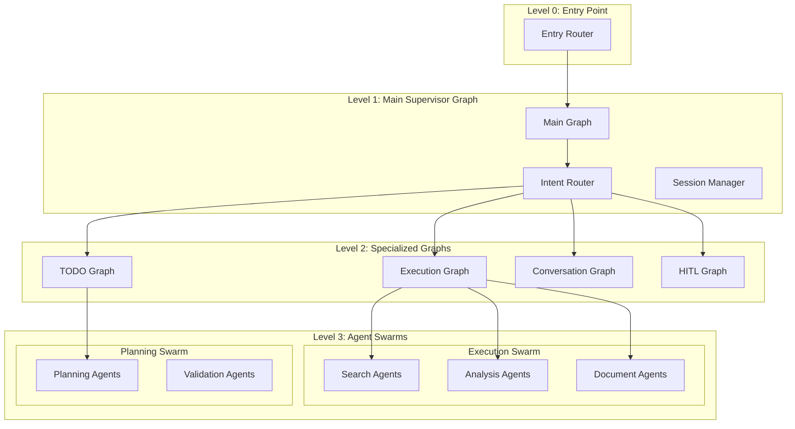
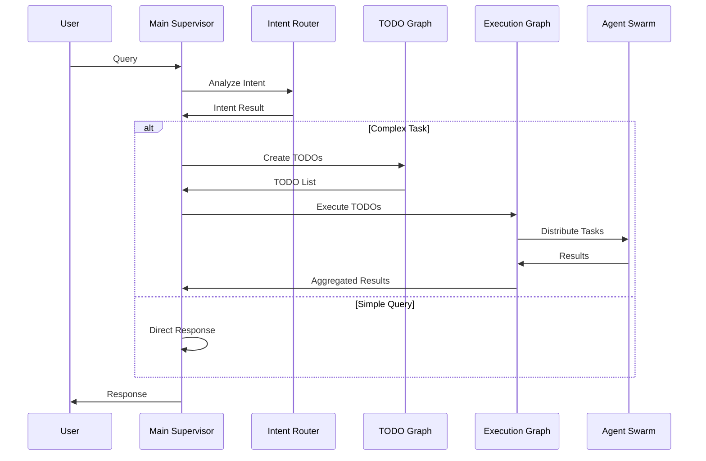

# Graph Architecture: Supervisor-Swarm & Multi-Graph System

## 1. 아키텍처 개요

Octostrator는 **Hierarchical Multi-Graph** 구조를 사용합니다:
- **Supervisor Pattern**: 중앙 조정자가 작업 분배
- **Swarm Pattern**: 여러 실행 에이전트가 협업
- **Multi-Graph**: 목적별 독립 그래프 운영



## 2. Supervisor-Swarm Pattern 구현

### 2.1 Main Supervisor Graph
```python
# backend/app/octostrator/graphs/main_supervisor.py
from langgraph.graph import StateGraph, END
from langgraph.types import Command, Send
from typing import List, Dict, Literal

class MainSupervisorGraph:
    """최상위 Supervisor - 전체 워크플로우 조정"""

    def __init__(self):
        self.graph = self._build_graph()
        self.subgraphs = {}
        self._register_subgraphs()

    def _build_graph(self) -> StateGraph:
        workflow = StateGraph(SupervisorState)

        # Supervisor 노드들
        workflow.add_node("entry", self.entry_node)
        workflow.add_node("intent_analysis", self.intent_analysis_node)
        workflow.add_node("task_distribution", self.task_distribution_node)
        workflow.add_node("result_aggregation", self.result_aggregation_node)
        workflow.add_node("response_generation", self.response_generation_node)

        # 흐름 정의
        workflow.set_entry_point("entry")
        workflow.add_edge("entry", "intent_analysis")
        workflow.add_conditional_edges(
            "intent_analysis",
            self._route_by_intent,
            {
                "distribute": "task_distribution",
                "direct": "response_generation",
                "subgraph": "invoke_subgraph"
            }
        )
        workflow.add_edge("task_distribution", "result_aggregation")
        workflow.add_edge("result_aggregation", "response_generation")
        workflow.add_edge("response_generation", END)

        return workflow.compile()

    def _register_subgraphs(self):
        """하위 그래프 등록"""
        from .todo_graph import TodoGraph
        from .execution_graph import ExecutionGraph
        from .conversation_graph import ConversationGraph
        from .hitl_graph import HITLGraph

        self.subgraphs = {
            "todo": TodoGraph(),
            "execution": ExecutionGraph(),
            "conversation": ConversationGraph(),
            "hitl": HITLGraph()
        }

    async def task_distribution_node(self, state: SupervisorState) -> List[Send]:
        """작업을 여러 에이전트에게 분배 (Swarm Pattern)"""
        tasks = state["pending_tasks"]

        # 병렬 처리를 위한 Send 생성
        sends = []
        for task in tasks:
            agent_type = self._determine_agent_type(task)

            # Swarm으로 작업 분배
            if agent_type == "search":
                # 여러 검색 에이전트에게 분산
                for i in range(3):  # 3개 검색 소스
                    sends.append(Send(
                        "search_agent",
                        {
                            "task": task,
                            "source": ["web", "docs", "code"][i],
                            "thread_id": state["thread_id"]
                        }
                    ))
            else:
                sends.append(Send(
                    f"{agent_type}_agent",
                    {"task": task, "thread_id": state["thread_id"]}
                ))

        return sends

    async def invoke_subgraph(self, state: SupervisorState) -> Command:
        """하위 그래프 호출"""
        target_graph = state["target_subgraph"]
        subgraph = self.subgraphs.get(target_graph)

        if not subgraph:
            raise ValueError(f"Unknown subgraph: {target_graph}")

        # 하위 그래프로 전환
        return Command(
            goto=f"subgraph_{target_graph}",
            update={
                "parent_state": state,
                "subgraph_input": state["subgraph_input"]
            }
        )

    def _route_by_intent(self, state: SupervisorState) -> Literal["distribute", "direct", "subgraph"]:
        """Intent에 따른 라우팅 결정"""
        intent = state["detected_intent"]["primary"]

        # 복잡한 작업은 분산 처리
        if intent in ["create", "analyze"] and len(state["pending_tasks"]) > 1:
            return "distribute"

        # 특정 그래프로 위임
        if intent in ["modify_todo", "review_todo"]:
            state["target_subgraph"] = "todo"
            return "subgraph"

        # 직접 응답
        if intent in ["query_status", "help"]:
            return "direct"

        return "distribute"
```

### 2.2 TODO Management Graph (Subgraph)
```python
# backend/app/octostrator/graphs/todo_graph.py
class TodoGraph:
    """TODO 전문 처리 그래프"""

    def __init__(self):
        self.graph = self._build_graph()

    def _build_graph(self) -> StateGraph:
        workflow = StateGraph(TodoState)

        workflow.add_node("todo_parser", self.parse_todos)
        workflow.add_node("dependency_analyzer", self.analyze_dependencies)
        workflow.add_node("priority_optimizer", self.optimize_priorities)
        workflow.add_node("validator", self.validate_todos)

        workflow.set_entry_point("todo_parser")
        workflow.add_edge("todo_parser", "dependency_analyzer")
        workflow.add_edge("dependency_analyzer", "priority_optimizer")
        workflow.add_edge("priority_optimizer", "validator")
        workflow.add_conditional_edges(
            "validator",
            lambda x: "parent" if x["validation_passed"] else "todo_parser",
            {"parent": END, "todo_parser": "todo_parser"}
        )

        return workflow.compile()

    async def parse_todos(self, state: TodoState) -> TodoState:
        """자연어에서 TODO 추출"""
        # LLM으로 TODO 파싱
        todos = await self._extract_todos_from_text(state["user_input"])
        state["todos"] = todos
        return state

    async def analyze_dependencies(self, state: TodoState) -> TodoState:
        """TODO 간 의존성 분석"""
        # DAG 구성
        dependency_graph = self._build_dependency_graph(state["todos"])
        state["dependency_graph"] = dependency_graph

        # 순환 참조 검사
        if self._has_circular_dependency(dependency_graph):
            raise ValueError("Circular dependency detected")

        return state

    async def optimize_priorities(self, state: TodoState) -> TodoState:
        """우선순위 최적화"""
        # Critical path 분석
        critical_path = self._find_critical_path(state["dependency_graph"])

        # 우선순위 재조정
        for todo in state["todos"]:
            if todo.id in critical_path:
                todo.priority = TodoPriority.HIGH

        return state

    # 부모 그래프로 복귀
    async def return_to_parent(self, state: TodoState) -> Command:
        """부모 그래프로 결과 반환"""
        return Command.PARENT(
            update={"processed_todos": state["todos"]}
        )
```

### 2.3 Execution Graph with Agent Swarm
```python
# backend/app/octostrator/graphs/execution_graph.py
class ExecutionGraph:
    """실행 전문 그래프 - Agent Swarm 관리"""

    def __init__(self):
        self.graph = self._build_graph()
        self.agent_pool = self._initialize_agent_pool()

    def _initialize_agent_pool(self):
        """에이전트 풀 초기화"""
        return {
            "search": [SearchAgent() for _ in range(5)],
            "analysis": [AnalysisAgent() for _ in range(3)],
            "document": [DocumentAgent() for _ in range(3)],
            "api": [APIAgent() for _ in range(2)]
        }

    def _build_graph(self) -> StateGraph:
        workflow = StateGraph(ExecutionState)

        workflow.add_node("task_scheduler", self.schedule_tasks)
        workflow.add_node("swarm_coordinator", self.coordinate_swarm)
        workflow.add_node("execution_monitor", self.monitor_execution)
        workflow.add_node("result_collector", self.collect_results)

        workflow.set_entry_point("task_scheduler")
        workflow.add_edge("task_scheduler", "swarm_coordinator")
        workflow.add_edge("swarm_coordinator", "execution_monitor")
        workflow.add_edge("execution_monitor", "result_collector")

        return workflow.compile()

    async def coordinate_swarm(self, state: ExecutionState) -> List[Send]:
        """Swarm 에이전트 조정"""
        scheduled_tasks = state["scheduled_tasks"]
        sends = []

        for task in scheduled_tasks:
            # 사용 가능한 에이전트 찾기
            agent_type = task["agent_type"]
            available_agents = self._get_available_agents(agent_type)

            if len(available_agents) > 1 and task.get("parallel"):
                # 병렬 실행 (여러 에이전트)
                for agent in available_agents[:task.get("parallel_count", 3)]:
                    sends.append(Send(
                        f"agent_{agent.id}",
                        {
                            "task": task,
                            "agent_id": agent.id,
                            "execution_mode": "parallel"
                        }
                    ))
            else:
                # 단일 에이전트 실행
                agent = available_agents[0]
                sends.append(Send(
                    f"agent_{agent.id}",
                    {
                        "task": task,
                        "agent_id": agent.id,
                        "execution_mode": "single"
                    }
                ))

        return sends

    async def monitor_execution(self, state: ExecutionState) -> ExecutionState:
        """실행 모니터링 및 오케스트레이션"""
        executions = state["active_executions"]

        # 실시간 모니터링
        for execution in executions:
            status = await self._check_execution_status(execution["agent_id"])

            if status["status"] == "failed":
                # 재시도 또는 다른 에이전트 할당
                alternative_agent = self._find_alternative_agent(
                    execution["agent_type"]
                )
                if alternative_agent:
                    # 작업 재할당
                    await self._reassign_task(
                        execution["task"],
                        alternative_agent
                    )

            elif status["status"] == "timeout":
                # 타임아웃 처리
                await self._handle_timeout(execution)

        return state
```

## 3. Multi-Graph Communication

### 3.1 Cross-Graph Messaging
```python
# backend/app/octostrator/graphs/graph_communication.py
class GraphCommunicator:
    """그래프 간 통신 관리"""

    def __init__(self):
        self.message_bus = MessageBus()
        self.graph_registry = {}

    async def send_message(
        self,
        from_graph: str,
        to_graph: str,
        message: Dict
    ):
        """그래프 간 메시지 전송"""
        await self.message_bus.publish(
            channel=f"graph:{to_graph}",
            message={
                "from": from_graph,
                "to": to_graph,
                "timestamp": datetime.now(),
                "payload": message
            }
        )

    async def broadcast(self, from_graph: str, message: Dict):
        """모든 그래프에 브로드캐스트"""
        for graph_name in self.graph_registry:
            if graph_name != from_graph:
                await self.send_message(from_graph, graph_name, message)

    async def request_assistance(
        self,
        requesting_graph: str,
        task_type: str,
        task_data: Dict
    ) -> Dict:
        """다른 그래프에 작업 지원 요청"""
        # 적합한 그래프 찾기
        capable_graph = self._find_capable_graph(task_type)

        if capable_graph:
            response = await self.send_message(
                requesting_graph,
                capable_graph,
                {
                    "type": "assistance_request",
                    "task_type": task_type,
                    "data": task_data
                }
            )
            return await self._wait_for_response(response["message_id"])

        return {"status": "no_capable_graph_found"}
```

### 3.2 Hierarchical State Management
```python
# backend/app/octostrator/graphs/hierarchical_state.py
class HierarchicalStateManager:
    """계층적 상태 관리"""

    def __init__(self):
        self.state_tree = {}
        self.checkpointer = AsyncPostgresSaver()

    async def create_child_state(
        self,
        parent_thread_id: str,
        child_graph_type: str
    ) -> str:
        """자식 상태 생성"""
        child_thread_id = f"{parent_thread_id}:{child_graph_type}:{uuid4()}"

        # 부모 상태 상속
        parent_state = await self.get_state(parent_thread_id)
        child_state = {
            "parent_thread_id": parent_thread_id,
            "graph_type": child_graph_type,
            "inherited_context": self._extract_inheritable_context(parent_state),
            "created_at": datetime.now()
        }

        await self.save_state(child_thread_id, child_state)
        return child_thread_id

    async def merge_child_results(
        self,
        parent_thread_id: str,
        child_thread_id: str
    ):
        """자식 결과를 부모에 병합"""
        child_state = await self.get_state(child_thread_id)
        parent_state = await self.get_state(parent_thread_id)

        # 결과 병합
        merge_strategy = self._get_merge_strategy(child_state["graph_type"])
        merged_state = merge_strategy(parent_state, child_state)

        await self.save_state(parent_thread_id, merged_state)

    def _get_merge_strategy(self, graph_type: str):
        """그래프 타입별 병합 전략"""
        strategies = {
            "todo": self._merge_todo_results,
            "execution": self._merge_execution_results,
            "conversation": self._merge_conversation_context
        }
        return strategies.get(graph_type, self._default_merge)
```

## 4. Swarm Intelligence Features

### 4.1 Collective Decision Making
```python
# backend/app/octostrator/swarm/collective_decision.py
class SwarmDecisionMaker:
    """Swarm 집단 의사결정"""

    async def collective_vote(
        self,
        agents: List[Agent],
        question: str,
        options: List[str]
    ) -> str:
        """에이전트들의 투표로 결정"""
        votes = {}

        # 각 에이전트의 투표 수집
        tasks = [
            agent.vote(question, options)
            for agent in agents
        ]
        results = await asyncio.gather(*tasks)

        # 투표 집계
        for vote in results:
            option = vote["choice"]
            confidence = vote["confidence"]
            votes[option] = votes.get(option, 0) + confidence

        # 가중 투표 결과
        return max(votes, key=votes.get)

    async def consensus_building(
        self,
        agents: List[Agent],
        proposal: str
    ) -> bool:
        """합의 도달"""
        rounds = 0
        max_rounds = 3

        while rounds < max_rounds:
            # 각 에이전트의 의견 수집
            opinions = await asyncio.gather(*[
                agent.evaluate_proposal(proposal)
                for agent in agents
            ])

            # 합의 확인
            agreement_ratio = sum(1 for o in opinions if o["agrees"]) / len(opinions)

            if agreement_ratio > 0.7:  # 70% 이상 동의
                return True

            # 의견 공유 및 재평가
            await self._share_opinions(agents, opinions)
            rounds += 1

        return False
```

### 4.2 Load Balancing & Auto-scaling
```python
# backend/app/octostrator/swarm/load_balancer.py
class SwarmLoadBalancer:
    """Swarm 부하 분산"""

    def __init__(self):
        self.agent_metrics = {}
        self.scaling_policy = AutoScalingPolicy()

    async def distribute_load(
        self,
        tasks: List[Task],
        available_agents: List[Agent]
    ) -> Dict[Agent, List[Task]]:
        """부하 분산"""
        assignments = {}

        # 에이전트 성능 메트릭 수집
        for agent in available_agents:
            metrics = await self._get_agent_metrics(agent)
            self.agent_metrics[agent.id] = metrics

        # 작업 분배 알고리즘
        for task in tasks:
            # 가장 적합한 에이전트 선택
            best_agent = self._select_best_agent(
                task,
                available_agents,
                self.agent_metrics
            )

            if best_agent not in assignments:
                assignments[best_agent] = []
            assignments[best_agent].append(task)

            # 부하 업데이트
            self._update_load_metric(best_agent, task)

        return assignments

    async def auto_scale(self):
        """자동 스케일링"""
        current_load = self._calculate_total_load()

        if current_load > self.scaling_policy.scale_up_threshold:
            # 에이전트 추가
            new_agents = await self._spawn_agents(
                count=self.scaling_policy.scale_up_count
            )
            return new_agents

        elif current_load < self.scaling_policy.scale_down_threshold:
            # 에이전트 제거
            removed_agents = await self._remove_idle_agents(
                count=self.scaling_policy.scale_down_count
            )
            return removed_agents

        return []
```

## 5. Architecture Summary

### 특징별 구조 매핑

| Feature | Implementation | Graph Type |
|---------|---------------|------------|
| **Intent Detection** | Main Supervisor | Entry Graph |
| **TODO Management** | TODO Graph | Subgraph |
| **Task Execution** | Execution Graph | Subgraph with Swarm |
| **HITL** | HITL Graph | Specialized Graph |
| **Conversation** | Conversation Graph | Context Graph |
| **Load Balancing** | Swarm Coordinator | Meta-level |
| **State Management** | Hierarchical Manager | Cross-graph |

### 통신 패턴



### 확장성 고려사항

1. **수평 확장**: 각 그래프 독립 스케일링
2. **수직 확장**: 계층 추가 가능
3. **플러그인**: 새 그래프/에이전트 동적 추가
4. **페일오버**: 그래프별 독립 복구