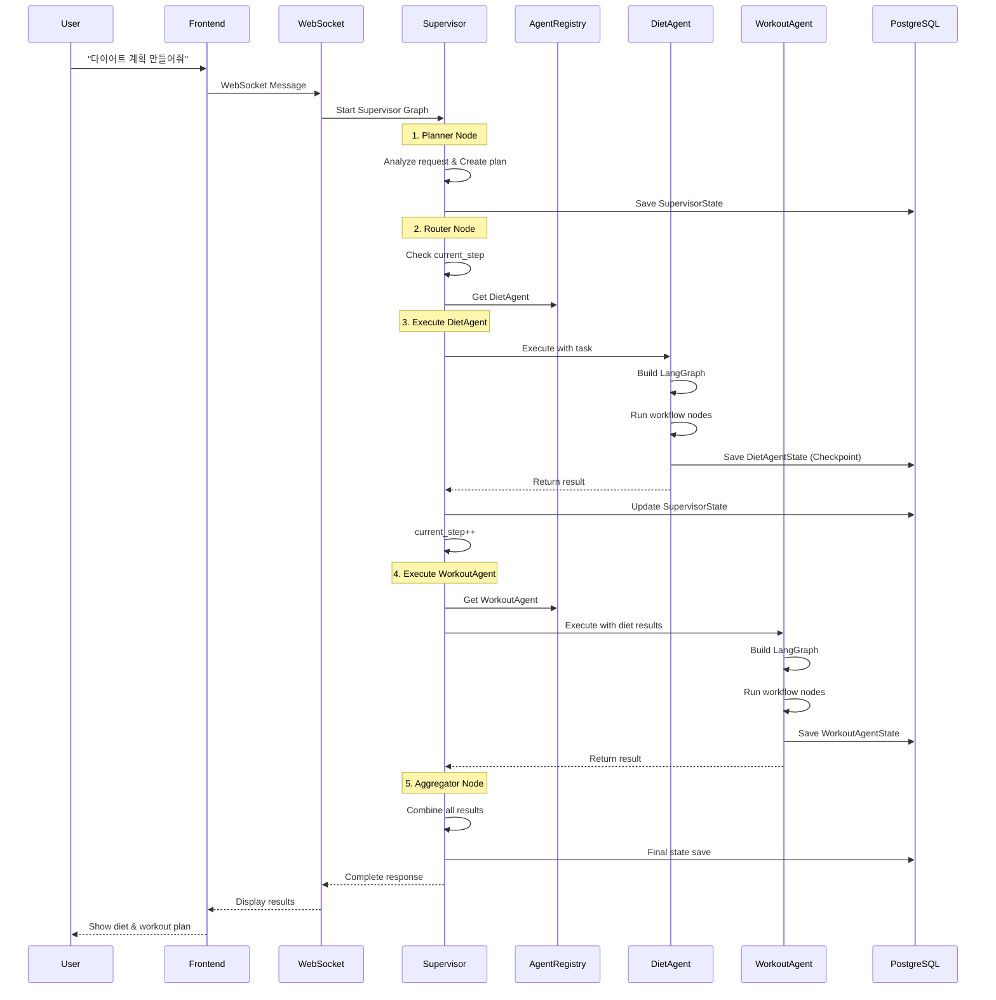

# Execution Flow Diagram - Supervisor + LangGraph Agents

**작성일**: 2025-11-05
**작성자**: AI Assistant
**목적**: 시스템 실행 흐름을 시각적으로 표현

---

## 1. 전체 실행 흐름도



---

## 2. Supervisor 내부 실행 흐름

```
┌─────────────────────────────────────────────────────┐
│                 SUPERVISOR GRAPH                     │
├─────────────────────────────────────────────────────┤
│                                                      │
│  START                                               │
│    │                                                 │
│    ▼                                                 │
│  [Planner Node]                                      │
│    │ Create execution plan                           │
│    │ plan = [                                        │
│    │   {agent: "diet", task: "analyze"},            │
│    │   {agent: "diet", task: "plan"},               │
│    │   {agent: "workout", task: "plan"},            │
│    │   {agent: "schedule", task: "integrate"}       │
│    │ ]                                               │
│    ▼                                                 │
│  [Router Node] ◄──────────────┐                      │
│    │ Check current_step       │                      │
│    │ Route to agent           │                      │
│    ▼                          │                      │
│  [Agent Executor]             │                      │
│    │ Run selected agent       │                      │
│    │ Update state             │                      │
│    ▼                          │                      │
│  <Decision>                   │                      │
│    │ More agents?             │                      │
│    ├─Yes─────────────────────┘                      │
│    │                                                 │
│    └─No                                              │
│    ▼                                                 │
│  [Aggregator Node]                                   │
│    │ Combine results                                 │
│    │ Generate summary                                │
│    ▼                                                 │
│  [Human Review?]                                     │
│    │                                                 │
│    ├─Yes──► [Wait Node] ──► [Human Input] ──┐       │
│    │                                         │       │
│    └─No                                      │       │
│    ▼                                         ▼       │
│  [Output Node]◄──────────────────────────────┘       │
│    │                                                 │
│    ▼                                                 │
│   END                                                │
│                                                      │
└─────────────────────────────────────────────────────┘
```

---

## 3. Agent 내부 실행 흐름 (DietAgent 예시)

```
┌─────────────────────────────────────────────────────┐
│                 DIET AGENT GRAPH                     │
├─────────────────────────────────────────────────────┤
│                                                      │
│  START                                               │
│    │                                                 │
│    ▼                                                 │
│  [Analyze User Node]                                 │
│    │ - Extract user profile                          │
│    │ - Calculate BMI                                 │
│    │ - Determine goals                               │
│    ▼                                                 │
│  [Plan Meals Node]                                   │
│    │ - Create 7-day meal plan                        │
│    │ - Consider restrictions                         │
│    │ - Balance nutrition                             │
│    ▼                                                 │
│  [Calculate Nutrition Node]                          │
│    │ - Sum calories                                  │
│    │ - Check macros                                  │
│    │ - Validate goals                                │
│    ▼                                                 │
│  [Generate Shopping List Node]                       │
│    │ - Extract ingredients                           │
│    │ - Group by category                             │
│    │ - Calculate quantities                          │
│    ▼                                                 │
│  [Format Output Node]                                │
│    │ - Structure results                             │
│    │ - Create summary                                │
│    │ - Add recommendations                           │
│    ▼                                                 │
│   END                                                │
│                                                      │
└─────────────────────────────────────────────────────┘
```

---

## 4. State 전달 흐름

### 4.1 State 변환 과정

```
SupervisorState                    Agent Input
┌─────────────────┐               ┌─────────────────┐
│ messages: [..] │──Transform──▶ │ task: {...}     │
│ plan: [..]     │               │ user_context: {}│
│ current_step: 1│               │ messages: []    │
│ thread_id: 123 │               │                 │
└─────────────────┘               └─────────────────┘
                                          │
                                          ▼
                                   AgentState
                                  ┌─────────────────┐
                                  │ agent_id: diet │
                                  │ task: {...}     │
                                  │ user_profile: {}│
                                  │ meal_plan: {}   │
                                  └─────────────────┘
                                          │
                                          ▼
                                   Agent Output
                                  ┌─────────────────┐
                                  │ result: {...}   │
                                  │ status: done    │
                                  │ messages: [..]  │
                                  └─────────────────┘
                                          │
    Updated SupervisorState       ◄──Transform───┘
    ┌─────────────────┐
    │ messages: [+++] │
    │ plan: [updated] │
    │ current_step: 2 │
    │ aggregated: {} │
    └─────────────────┘
```

### 4.2 Thread ID 관리

```
Session Level:
session_123 (User Session)
    │
    ├── thread_123 (Supervisor Thread)
    │      │
    │      ├── thread_123_diet (DietAgent Thread)
    │      ├── thread_123_workout (WorkoutAgent Thread)
    │      └── thread_123_schedule (ScheduleAgent Thread)
    │
    └── Stateless Agents (No Thread)
           ├── NotificationAgent
           └── ReportingAgent
```

---

## 5. 병렬 실행 흐름

### 5.1 의존성 기반 병렬화

```
Initial Plan:
[diet_analyze, diet_plan, workout_plan, schedule_integrate, notify]

Dependency Analysis:
diet_analyze → diet_plan → workout_plan → schedule_integrate → notify

Parallel Groups:
┌────────────────────────────────────────────────┐
│ Level 0: [diet_analyze]           (독립 실행)  │
│    ↓                                           │
│ Level 1: [diet_plan]              (대기)      │
│    ↓                                           │
│ Level 2: [workout_plan, meal_prep] (병렬 가능) │
│    ↓                                           │
│ Level 3: [schedule_integrate]      (대기)      │
│    ↓                                           │
│ Level 4: [notify]                  (마지막)    │
└────────────────────────────────────────────────┘
```

### 5.2 병렬 실행 타임라인

```
Time    Supervisor          DietAgent       WorkoutAgent    ScheduleAgent
────────────────────────────────────────────────────────────────────────
T0      Start               -               -               -
T1      Route→Diet          Start           -               -
T2      Wait                Analyzing       -               -
T3      Wait                Planning        -               -
T4      Get Result          Complete        -               -
T5      Route→Parallel      -               Start           -
T6      Wait                -               Planning        -
T7      Route→Schedule      -               Complete        Start
T8      Wait                -               -               Integrating
T9      Aggregate           -               -               Complete
T10     End                 -               -               -
```

---

## 6. 에러 처리 흐름

### 6.1 Agent 실패 시

```
Supervisor                  FailedAgent
    │                           │
    ├──Execute───────────▶     │
    │                           │
    │                         [Error]
    │                           │
    │◄──Error Response──────────│
    │
    ├──Retry Decision
    │   ├─Retry──────────▶ [Retry with adjusted params]
    │   │
    │   └─Skip───────────▶ [Mark as failed, continue]
    │
    └──Update State
        └─plan[i].status = "failed"
```

### 6.2 Checkpoint 복구

```
System Restart Scenario:

1. System crashes at T5
   SupervisorState: current_step=2, plan=[✓,✓,●,○,○]
   DietAgentState: Saved (meal_plan complete)
   WorkoutAgentState: In progress

2. System restarts
   │
   ├─Load SupervisorState from PostgreSQL
   ├─Resume from current_step=2
   ├─Load DietAgent checkpoint (if needed)
   └─Continue execution

3. Recovery complete
   Continue from workout planning
```

---

## 7. 실제 코드 실행 흐름

### 7.1 WebSocket 엔드포인트

```python
# backend/app/api/websocket.py
@router.websocket("/ws/chat/{session_id}")
async def websocket_endpoint(websocket: WebSocket, session_id: str):
    # 1. WebSocket 연결 수락
    await websocket.accept()

    # 2. Supervisor Graph 생성
    checkpointer = await create_checkpointer()
    supervisor = build_supervisor_graph(checkpointer)

    # 3. 메시지 처리 루프
    while True:
        message = await websocket.receive_text()

        # 4. Supervisor 실행
        result = await supervisor.ainvoke(
            {"messages": [HumanMessage(content=message)]},
            config={"configurable": {"thread_id": session_id}}
        )

        # 5. 결과 전송
        await websocket.send_json({
            "type": "response",
            "content": result["final_result"]
        })
```

### 7.2 Supervisor Graph 구축

```python
# backend/app/octostrator/supervisor/main_graph.py
def build_supervisor_graph(checkpointer):
    workflow = StateGraph(SupervisorState)

    # Supervisor 핵심 노드
    workflow.add_node("planner", planner_node)
    workflow.add_node("executor", agent_executor_node)
    workflow.add_node("aggregator", aggregator_node)

    # 엣지 정의
    workflow.add_edge(START, "planner")
    workflow.add_edge("planner", "executor")
    workflow.add_conditional_edges(
        "executor",
        should_continue,
        {
            "continue": "executor",
            "aggregate": "aggregator"
        }
    )
    workflow.add_edge("aggregator", END)

    return workflow.compile(checkpointer=checkpointer)
```

### 7.3 Agent 실행 노드

```python
async def agent_executor_node(state: SupervisorState):
    """Agent를 실행하는 Supervisor 노드"""

    # 1. 현재 실행할 Agent 확인
    current_task = state["plan"][state["current_step"]]
    agent_id = current_task["agent"]

    # 2. Agent 가져오기
    agent = agent_registry.get_agent_instance(agent_id)
    if not agent:
        # 처음 실행이면 생성
        agent = agent_registry.create_agent(agent_id)

        # Checkpoint 전략 확인
        if checkpoint_strategy.should_use_checkpoint(agent_id):
            cp = await checkpoint_strategy.get_checkpointer(agent_id)
            await agent.initialize(llm, cp)
        else:
            await agent.initialize(llm, None)

    # 3. Agent 실행
    thread_id = f"{state['thread_id']}_{agent_id}"
    result = await agent.execute(
        task=current_task,
        context={"user_id": state.get("user_id")},
        thread_id=thread_id
    )

    # 4. State 업데이트
    return {
        "plan": update_plan(state["plan"], state["current_step"], result),
        "current_step": state["current_step"] + 1,
        "aggregated_data": {
            **state.get("aggregated_data", {}),
            agent_id: result
        }
    }
```

---

## 8. 모니터링 포인트

### 8.1 주요 측정 지표

```
Supervisor Level:
├─ Total execution time
├─ Number of agents executed
├─ Checkpoint save count
└─ State size growth

Agent Level:
├─ Individual execution time
├─ Node execution count
├─ Checkpoint size
└─ Error/retry count

System Level:
├─ PostgreSQL query count
├─ Memory usage
├─ WebSocket message count
└─ Concurrent sessions
```

### 8.2 로깅 포인트

```python
# 각 단계별 로깅
logger.info(f"[Supervisor] Starting execution for session {session_id}")
logger.info(f"[Supervisor] Created plan with {len(plan)} steps")
logger.info(f"[Supervisor] Executing {agent_id} (step {current_step}/{total})")
logger.info(f"[{agent_id}] Initialized with checkpoint={enable_checkpoint}")
logger.info(f"[{agent_id}] Executing task: {task['type']}")
logger.info(f"[{agent_id}] Completed in {elapsed_time}s")
logger.info(f"[Supervisor] All agents completed, aggregating results")
```

---

## 9. 요약

### 핵심 흐름
1. **User → WebSocket → Supervisor**: 요청 시작
2. **Supervisor → Planner**: 실행 계획 수립
3. **Supervisor → Agent**: 순차/병렬 실행
4. **Agent → LangGraph**: 복잡한 워크플로우 처리
5. **Agent → Supervisor**: 결과 반환
6. **Supervisor → Aggregator**: 결과 종합
7. **Supervisor → WebSocket → User**: 최종 응답

### 핵심 특징
- **Supervisor는 계속 사용**: 전체 조율자 역할
- **Agent는 더 복잡해짐**: LangGraph 기반 워크플로우
- **선택적 Checkpoint**: Agent별 필요에 따라
- **병렬 실행**: 의존성 기반 자동화
- **확장 가능**: 10+ Agent 지원 구조

---

**작성 완료일**: 2025-11-05
**버전**: 1.0
**문서 위치**: `reports/supervisor/EXECUTION_FLOW_DIAGRAM_251105.md`