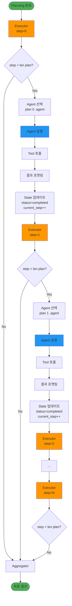
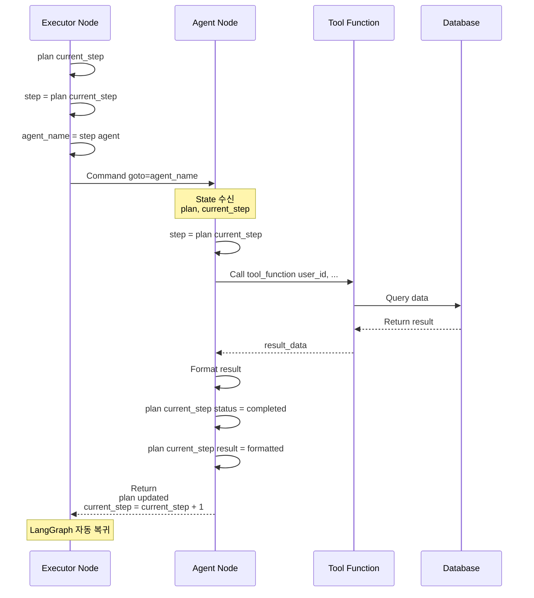
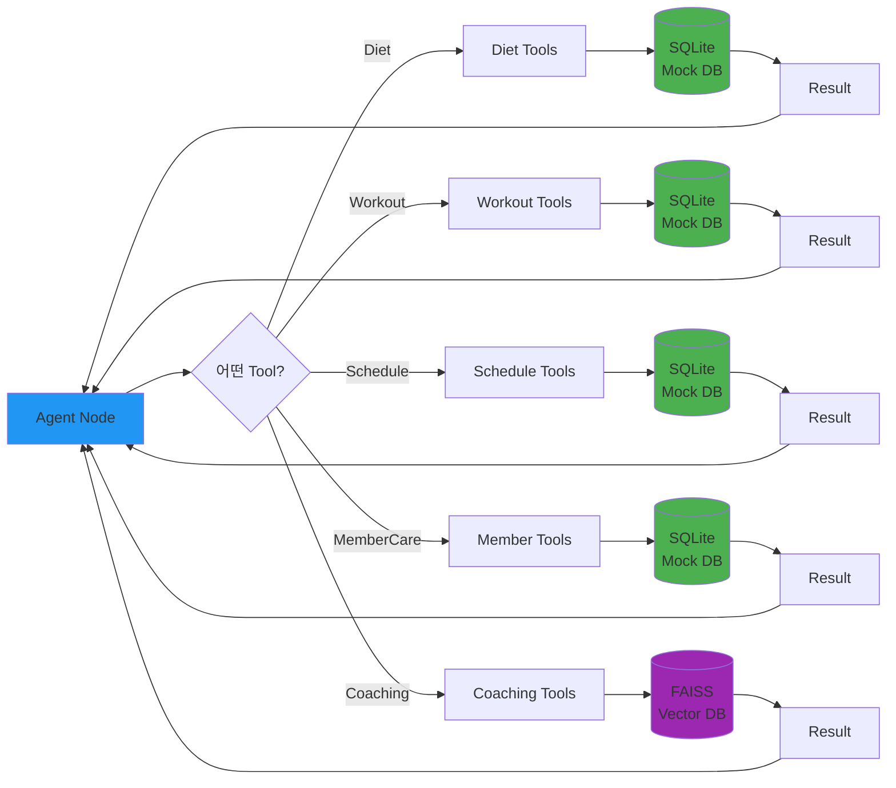

# Agent Flow - 에이전트 실행 흐름

**작성일**: 2025-11-04
**버전**: Phase 3.6 (Tool 기반 아키텍처)

---

## 1. Agent 실행 개요

### 1.1 실행 원리

```
Executor Node (제어)
     │
     ├─ Command(goto="diet") ──────────▶ Diet Agent
     │                                       │
     │                                   [작업 수행]
     │                                       │
     │                                   current_step++
     │                                       │
     │  ◀─────────────────────────────────┘
     │
     ├─ Command(goto="workout") ────────▶ Workout Agent
     │                                       │
     │                                   [작업 수행]
     │                                       │
     │  ◀─────────────────────────────────┘
     │
    ...
```

**핵심 원리**:
1. Executor가 `plan[current_step]`을 확인
2. `Command(goto="agent_name")`로 Agent 호출
3. Agent가 작업 수행 후 `current_step + 1` 반환
4. Executor로 자동 복귀 (LangGraph 엣지)
5. 모든 단계 완료 시 Aggregator로 이동

---

## 2. Executor Node 상세

### 2.1 Executor 로직

```python
async def executor_node(state: SupervisorState) -> Command:
    plan = state.get("plan", [])
    current_step = state.get("current_step", 0)

    # 1. 완료 체크
    if current_step >= len(plan):
        return Command(
            update={"is_executing": False},
            goto="aggregator"
        )

    # 2. 현재 단계 가져오기
    step = plan[current_step]

    # 3. Agent 선택
    agent_name = step["agent"]  # "diet", "workout", "schedule" 등

    # 4. 상태 업데이트 (running)
    updated_plan = update_step_status(plan, current_step, "running")

    # 5. Command 반환 (동적 라우팅)
    return Command(
        update={"plan": updated_plan},
        goto=agent_name
    )
```

### 2.2 Executor 흐름도

```
┌────────────────────────────────────────────────────┐
│               Executor Node                        │
│                                                    │
│  1. plan = state["plan"]                          │
│  2. current_step = state["current_step"]          │
│                                                    │
│  3. IF current_step >= len(plan):                 │
│        → Command(goto="aggregator")               │
│                                                    │
│  4. step = plan[current_step]                     │
│  5. agent_name = step["agent"]                    │
│                                                    │
│  6. plan[current_step]["status"] = "running"      │
│                                                    │
│  7. RETURN Command(goto=agent_name)               │
└────────────────────────────────────────────────────┘
```

---

## 3. Agent 실행 패턴

### 3.1 공통 Agent 구조

모든 Fitness Agent는 동일한 패턴을 따릅니다:

```python
async def {agent}_agent_node(state: SupervisorState) -> Dict:
    # 1. State에서 정보 추출
    plan = state["plan"]
    current_step = state["current_step"]
    step = plan[current_step]

    try:
        # 2. Tool 호출 (비즈니스 로직)
        result_data = {tool_function}(
            user_id=state.get("user_id", 1),
            ...
        )

        # 3. 결과 포맷팅
        result_text = format_result(result_data, step["description"])

        # 4. State 업데이트
        plan[current_step]["status"] = "completed"
        plan[current_step]["result"] = result_text

        # 5. 다음 단계로 진행
        return {
            "plan": plan,
            "current_step": current_step + 1,  # 핵심!
            "messages": [AIMessage(content=result_text)]
        }

    except Exception as e:
        # 6. 에러 처리
        plan[current_step]["status"] = "failed"
        plan[current_step]["error"] = str(e)
        return {
            "plan": plan,
            "current_step": current_step + 1
        }
```

### 3.2 Agent 실행 흐름

```
┌─────────────────────────────────────────────────────┐
│               Diet Agent Example                    │
│                                                     │
│  1. plan = state["plan"]                           │
│  2. current_step = state["current_step"]  # 예: 2  │
│  3. step = plan[2]                                 │
│     - agent: "diet"                                │
│     - description: "김철수 회원의 식단 기록 조회"    │
│                                                     │
│  4. Tool 호출:                                      │
│     meal_logs = get_meal_logs(user_id=1, limit=3) │
│                                                     │
│  5. 결과 포맷팅:                                    │
│     result = "[DietAgent] 최근 식단:\n"            │
│              "- 아침: 계란 2개, 우유 200ml\n"       │
│              "- 점심: 닭가슴살 200g, 브로콜리\n"    │
│                                                     │
│  6. State 업데이트:                                 │
│     plan[2]["status"] = "completed"                │
│     plan[2]["result"] = result                     │
│                                                     │
│  7. 반환:                                           │
│     return {                                        │
│         "plan": plan,                              │
│         "current_step": 3,  # 2 → 3               │
│         "messages": [AIMessage(...)]               │
│     }                                               │
└─────────────────────────────────────────────────────┘
                     │
                     ▼
              (Executor로 복귀)
```

---

## 4. 5개 Fitness Agents

### 4.1 Diet Agent

**파일**: `backend/app/octostrator/agents/diet/agent.py`

**역할**: 식단 기록 조회 및 영양소 분석

**Tools**:
- `get_meal_logs(user_id, limit)` - 식단 기록 조회
- `get_daily_nutrition_summary(user_id)` - 일일 영양소 집계

**예시 결과**:
```
[DietAgent] 최근 식단 기록 조회

최근 식단 기록:

- 아침 (2025-11-04): 계란 2개, 우유 200ml
  영양소: 350kcal, 단백질 25g

- 점심 (2025-11-04): 닭가슴살 200g, 브로콜리 100g
  영양소: 450kcal, 단백질 40g

오늘의 총 섭취량:
- 칼로리: 800kcal
- 단백질: 65g
- 탄수화물: 50g
- 지방: 25g
(총 2끼)
```

### 4.2 Workout Agent

**파일**: `backend/app/octostrator/agents/workout/agent.py`

**역할**: 운동 기록 조회 및 루틴 추천

**Tools**:
- `get_workouts(user_id, limit)` - 운동 기록 조회
- `get_exercise_details(exercise_ids)` - 운동 상세 정보

**예시 결과**:
```
[WorkoutAgent] 김철수 회원의 운동 기록 조회

최근 운동 기록:

1. 2025-11-04 하체 운동 (90분)
   - 스쿼트: 60kg × 10회 × 3세트
   - 레그프레스: 100kg × 12회 × 3세트
   - 레그컬: 40kg × 15회 × 3세트

2. 2025-11-02 상체 운동 (80분)
   - 벤치프레스: 50kg × 10회 × 3세트
   - 덤벨플라이: 15kg × 12회 × 3세트
```

### 4.3 Schedule Agent

**파일**: `backend/app/octostrator/agents/schedule/agent.py`

**역할**: PT 스케줄 조회 및 예약

**Tools**:
- `get_schedules(user_id, limit)` - 스케줄 조회
- `create_schedule(user_id, trainer_id, datetime)` - 스케줄 생성

**예시 결과**:
```
[ScheduleAgent] PT 스케줄 예약

예정된 PT 스케줄:
- 2025-11-05 14:00 - 김트레이너 (하체 집중)
- 2025-11-07 16:00 - 박트레이너 (상체 집중)
- 2025-11-09 10:00 - 김트레이너 (전신 운동)
```

### 4.4 Member Care Agent

**파일**: `backend/app/octostrator/agents/member_care/agent.py`

**역할**: 회원 정보 조회 및 진행률 리포트

**Tools**:
- `get_users(user_name, user_id)` - 회원 정보 조회
- `get_progress_data(user_id, limit)` - 진행률 데이터 조회

**예시 결과**:
```
[MemberCareAgent] 김철수 회원 정보 조회

회원 정보:
- 이름: 김철수
- 나이: 30세
- 성별: 남성
- 체중: 75kg
- 목표 체중: 70kg

최근 진행 상황:
- 2025-11-01: 75.5kg
- 2025-11-04: 75.0kg (△ -0.5kg)
```

### 4.5 Coaching Agent

**파일**: `backend/app/octostrator/agents/coaching/agent.py`

**역할**: 운동 자세 영상 및 전문 자료 검색

**Tools**:
- `search_exercise_videos(query)` - 운동 영상 검색 (FAISS)
- `search_nutrition_articles(query)` - 영양 정보 검색 (FAISS)

**예시 결과**:
```
[CoachingAgent] 하체 운동 자세 영상 검색

검색 결과 (유사도 상위 3개):

1. "스쿼트 완벽 가이드" (유사도: 0.92)
   - URL: https://example.com/squat-guide
   - 내용: 스쿼트의 올바른 자세와 호흡법
   - 길이: 10:23

2. "레그프레스 자세 교정" (유사도: 0.87)
   - URL: https://example.com/leg-press
   - 내용: 레그프레스 시 흔한 실수와 교정법
   - 길이: 8:15
```

---

## 5. Mermaid 다이어그램

### 5.1 전체 Agent 실행 순서



### 5.2 단일 Agent 실행 시퀀스



### 5.3 Tool 호출 구조



---

## 6. State 변화 추적

### 6.1 예시: 4단계 실행

**초기 State** (Planning 완료):
```python
{
    "plan": [
        {"step_id": 1, "agent": "member_care", "status": "pending", "description": "...", "result": None},
        {"step_id": 2, "agent": "workout", "status": "pending", "description": "...", "result": None},
        {"step_id": 3, "agent": "diet", "status": "pending", "description": "...", "result": None},
        {"step_id": 4, "agent": "schedule", "status": "pending", "description": "...", "result": None}
    ],
    "current_step": 0,
    "is_executing": True
}
```

**Step 0 완료 후**:
```python
{
    "plan": [
        {"step_id": 1, "agent": "member_care", "status": "completed", "result": "[MemberCareAgent] 김철수..."},
        {"step_id": 2, "agent": "workout", "status": "pending", ...},
        {"step_id": 3, "agent": "diet", "status": "pending", ...},
        {"step_id": 4, "agent": "schedule", "status": "pending", ...}
    ],
    "current_step": 1  # 0 → 1
}
```

**Step 1 완료 후**:
```python
{
    "plan": [
        {"step_id": 1, "status": "completed", ...},
        {"step_id": 2, "agent": "workout", "status": "completed", "result": "[WorkoutAgent] 최근 운동..."},
        {"step_id": 3, "agent": "diet", "status": "pending", ...},
        {"step_id": 4, "agent": "schedule", "status": "pending", ...}
    ],
    "current_step": 2  # 1 → 2
}
```

**Step 2 완료 후**:
```python
{
    "plan": [
        {"step_id": 1, "status": "completed", ...},
        {"step_id": 2, "status": "completed", ...},
        {"step_id": 3, "agent": "diet", "status": "completed", "result": "[DietAgent] 최근 식단..."},
        {"step_id": 4, "agent": "schedule", "status": "pending", ...}
    ],
    "current_step": 3  # 2 → 3
}
```

**Step 3 완료 후**:
```python
{
    "plan": [
        {"step_id": 1, "status": "completed", ...},
        {"step_id": 2, "status": "completed", ...},
        {"step_id": 3, "status": "completed", ...},
        {"step_id": 4, "agent": "schedule", "status": "completed", "result": "[ScheduleAgent] PT 예약..."}
    ],
    "current_step": 4  # 3 → 4
}
```

**모든 단계 완료**:
```python
# current_step (4) >= len(plan) (4)
# Executor → Aggregator로 이동
{
    "plan": [...],  # 모든 step이 completed
    "current_step": 4,
    "is_executing": False
}
```

---

## 7. 에러 처리 및 복구

### 7.1 Agent 에러 처리

```python
try:
    result = tool_function(...)
    plan[current_step]["status"] = "completed"
    plan[current_step]["result"] = result

except Exception as e:
    # 에러 발생 시에도 다음 단계로 진행
    plan[current_step]["status"] = "failed"
    plan[current_step]["error"] = str(e)
    plan[current_step]["result"] = f"Error: {str(e)}"

finally:
    # current_step은 항상 증가
    return {
        "plan": plan,
        "current_step": current_step + 1
    }
```

### 7.2 에러 전파

```
Agent에서 에러 발생
    ↓
status = "failed", error 저장
    ↓
current_step++ (계속 진행)
    ↓
Executor로 복귀
    ↓
다음 Agent 실행
    ↓
Aggregator에서 실패한 step 분석
    ↓
최종 결과에 에러 포함
```

**장점**: 하나의 Agent 실패가 전체 실행을 중단하지 않음

---

## 8. Tool 기반 아키텍처

### 8.1 Agent vs Tool 분리

**Agent (Orchestration)**:
```python
async def diet_agent_node(state):
    # 1. State 관리
    # 2. Tool 선택
    # 3. 결과 포맷팅
    # 4. State 업데이트
```

**Tool (Business Logic)**:
```python
def get_meal_logs(user_id, limit):
    # 1. DB 쿼리
    # 2. 데이터 변환
    # 3. 결과 반환
```

### 8.2 Tool 카테고리

**Diet Tools** (`backend/app/octostrator/tools/diet_tools.py`):
- `get_meal_logs(user_id, limit)`
- `get_daily_nutrition_summary(user_id)`
- `add_meal_log(user_id, meal_data)`

**Workout Tools** (`backend/app/octostrator/tools/workout_tools.py`):
- `get_workouts(user_id, limit)`
- `get_exercise_details(exercise_ids)`
- `create_workout(user_id, workout_data)`

**Schedule Tools** (`backend/app/octostrator/tools/schedule_tools.py`):
- `get_schedules(user_id, limit)`
- `create_schedule(user_id, trainer_id, datetime)`
- `update_schedule(schedule_id, data)`

**Member Tools** (`backend/app/octostrator/tools/member_tools.py`):
- `get_users(user_name, user_id)`
- `get_progress_data(user_id, limit)`
- `update_user_info(user_id, data)`

**Coaching Tools** (`backend/app/octostrator/tools/coaching_tools.py`):
- `search_exercise_videos(query, top_k)`
- `search_nutrition_articles(query, top_k)`
- `get_document_by_id(doc_id)`

---

## 9. 실행 예시 타임라인

### 질문: "김철수 회원의 운동과 식단을 확인하고 PT예약해줘"

```
T=0ms
├─ WebSocket 수신
└─ Graph 실행 시작

T=100ms
├─ Intent Node 시작
├─ LLM 분석: "multi_step_task"
└─ Intent Node 완료 (user_intent 설정)

T=500ms
├─ Planning Node 시작
├─ LLM 계획 생성
│  Step 1: member_care
│  Step 2: workout
│  Step 3: diet
│  Step 4: schedule
└─ Planning Node 완료 (plan 설정)

T=600ms
├─ Executor Node (step=0)
└─ Command(goto="member_care")

T=650ms
├─ Member Care Agent 시작
├─ Tool: get_users(user_name="김철수")
├─ DB 쿼리 (50ms)
└─ Member Care Agent 완료 (current_step=1)

T=700ms
├─ Executor Node (step=1)
└─ Command(goto="workout")

T=750ms
├─ Workout Agent 시작
├─ Tool: get_workouts(user_id=1)
├─ DB 쿼리 (50ms)
└─ Workout Agent 완료 (current_step=2)

T=800ms
├─ Executor Node (step=2)
└─ Command(goto="diet")

T=850ms
├─ Diet Agent 시작
├─ Tool: get_meal_logs(user_id=1)
├─ DB 쿼리 (50ms)
└─ Diet Agent 완료 (current_step=3)

T=900ms
├─ Executor Node (step=3)
└─ Command(goto="schedule")

T=950ms
├─ Schedule Agent 시작
├─ Tool: get_schedules(user_id=1)
├─ DB 쿼리 (50ms)
└─ Schedule Agent 완료 (current_step=4)

T=1000ms
├─ Executor Node (step=4)
└─ Command(goto="aggregator") [모든 단계 완료]

T=1500ms
├─ Aggregator Node 시작
├─ LLM 인사이트 생성
└─ Aggregator Node 완료 (aggregated_data 설정)

T=1600ms
├─ Output Router Node
└─ Command(goto="chat_generator")

T=1800ms
├─ Chat Generator Node 시작
├─ 대화형 답변 생성
└─ Chat Generator Node 완료 (final_result 설정)

T=1850ms
├─ END
└─ WebSocket 전송: final_result
```

**총 실행 시간**: 약 1.85초

---

## 10. 성능 최적화 포인트

### 10.1 현재 병목 지점

1. **LLM 호출** (가장 느림)
   - Intent: ~400ms
   - Planning: ~400ms
   - Aggregator: ~500ms

2. **DB 쿼리** (빠름)
   - SQLite: ~50ms/query
   - FAISS: ~100ms/search

3. **Agent 실행** (매우 빠름)
   - State 관리: <10ms
   - 포맷팅: <10ms

### 10.2 최적화 방향

**Phase 5: Parallel Execution**
```
현재 (순차):
member_care → workout → diet → schedule
(650ms + 750ms + 850ms + 950ms = 3200ms)

병렬 실행 (예상):
member_care ┐
workout     ├─→ (동시 실행)
diet        │
schedule    ┘
(max(650, 750, 850, 950) = 950ms)
```

**LLM 캐싱**:
- 동일한 질문 패턴 캐싱
- Intent 분류 결과 재사용

**Tool 결과 캐싱**:
- 짧은 기간 동안 동일 쿼리 결과 재사용

---

## 11. 디버깅 및 모니터링

### 11.1 로그 출력

**현재 로그**:
```
[WebSocket] Received message from session_xxx: 김철수 회원의...
[Graph] Node started: intent
[Graph] Node completed: intent
[Graph] Node started: planning
[Graph] Node completed: planning
[Graph] Node started: executor
[Graph] Node completed: executor
[Graph] Node started: member_care
[Graph] Node completed: member_care
...
```

### 11.2 State 추적

```python
# 각 Agent 실행 전후 State 로깅
print(f"[Agent] Before: current_step={state['current_step']}")
print(f"[Agent] plan[{current_step}]={plan[current_step]}")

# Agent 실행 후
print(f"[Agent] After: current_step={current_step + 1}")
print(f"[Agent] plan[{current_step}].status={plan[current_step]['status']}")
```

---

**작성자**: Claude Code
**관련 파일**:
- `backend/app/octostrator/supervisor/cognitive_nodes.py` (Executor)
- `backend/app/octostrator/agents/*/agent.py` (각 Agent)
- `backend/app/octostrator/tools/*_tools.py` (Tools)
