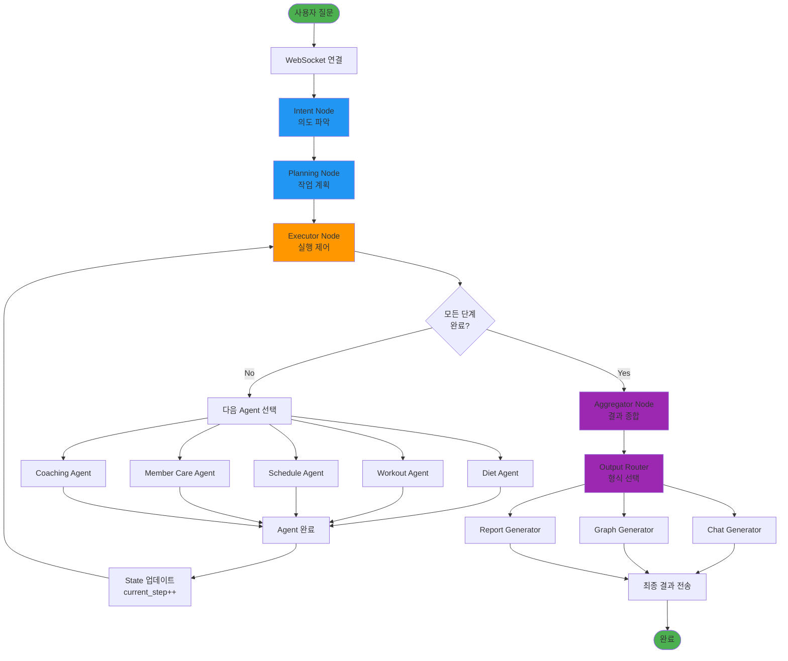
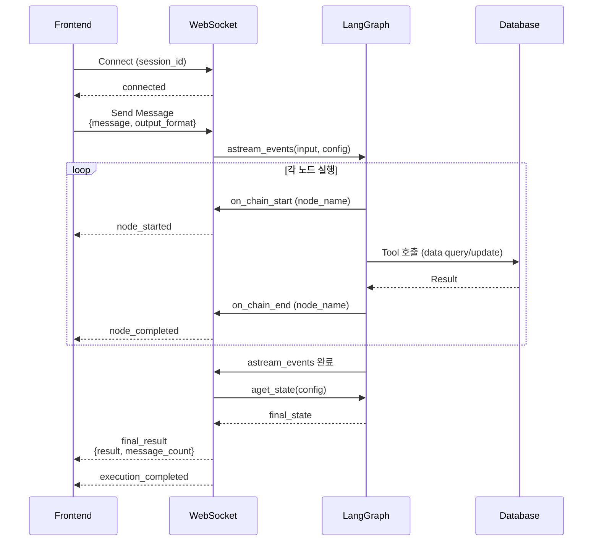
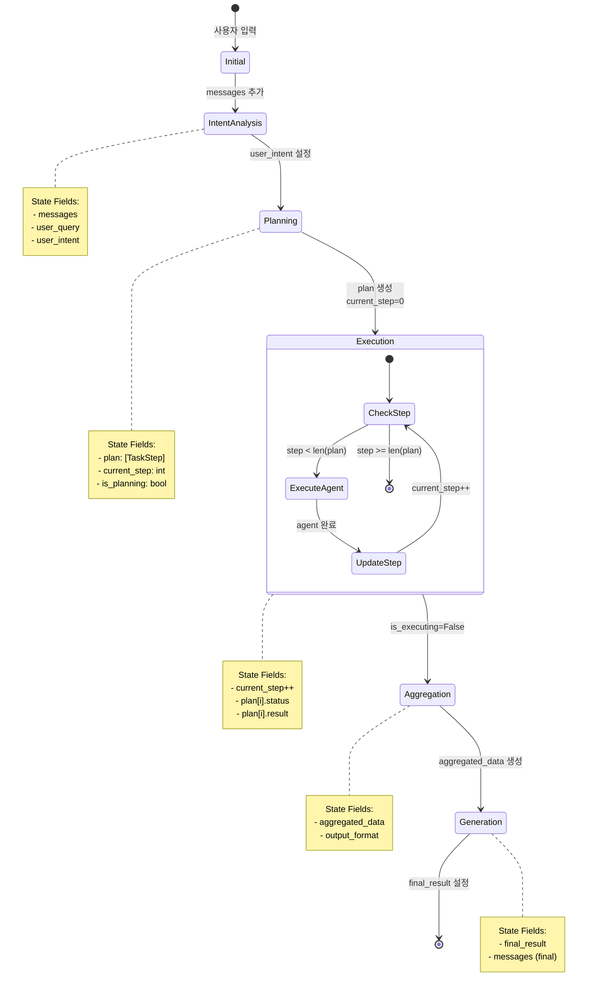

# System Flow - 전체 시스템 흐름

**작성일**: 2025-11-04
**버전**: Phase 3.6 (HITL 비활성화)

---

## 1. 전체 시스템 아키텍처

```
┌─────────────────────────────────────────────────────────────────────┐
│                         Frontend (React + TypeScript)                │
│                                                                       │
│  ┌─────────────┐     ┌──────────────┐     ┌────────────────────┐   │
│  │   App.tsx   │────▶│  WebSocket   │────▶│  Message Display   │   │
│  └─────────────┘     └──────────────┘     └────────────────────┘   │
│                             │                                        │
└─────────────────────────────┼────────────────────────────────────────┘
                              │ ws://localhost:8000/ws/chat/{session_id}
                              ▼
┌─────────────────────────────────────────────────────────────────────┐
│                      Backend (FastAPI + LangGraph)                   │
│                                                                       │
│  ┌─────────────┐     ┌──────────────┐     ┌────────────────────┐   │
│  │ websocket.py│────▶│ main_graph.py│────▶│  Supervisor Graph  │   │
│  └─────────────┘     └──────────────┘     └────────────────────┘   │
│                                                     │                │
│                                                     ▼                │
│  ┌──────────────────────────────────────────────────────────────┐   │
│  │                    LangGraph StateGraph                       │   │
│  │                                                               │   │
│  │   START → Intent → Planning → Executor → Agents → END        │   │
│  └──────────────────────────────────────────────────────────────┘   │
│                                                     │                │
└─────────────────────────────────────────────────────┼────────────────┘
                                                      ▼
┌─────────────────────────────────────────────────────────────────────┐
│                      Data Layer (Databases)                          │
│                                                                       │
│  ┌─────────────┐     ┌──────────────┐     ┌────────────────────┐   │
│  │   SQLite    │     │  PostgreSQL  │     │      FAISS         │   │
│  │ (Mock Data) │     │ (Checkpoint) │     │ (Vector Search)    │   │
│  └─────────────┘     └──────────────┘     └────────────────────┘   │
└─────────────────────────────────────────────────────────────────────┘
```

---

## 2. LangGraph 노드 구조

### 2.1 전체 노드 흐름

```
START
  │
  ▼
┌─────────────────────┐
│  Intent Node        │  사용자 의도 파악
│  (LLM 분석)         │  → Category, Subject, Complexity
└──────────┬──────────┘
           │
           ▼
┌─────────────────────┐
│  Planning Node      │  작업을 TaskStep 리스트로 분해
│  (LLM Structured)   │  → plan: [step1, step2, ...]
└──────────┬──────────┘
           │
           ▼
┌─────────────────────┐
│  Executor Node      │◄─────────────────┐
│  (Command Router)   │                  │
└──────────┬──────────┘                  │
           │                             │
           ├──────────────────────┐      │
           │                      │      │
           ▼                      ▼      │
┌─────────────────────┐  ┌─────────────────────┐
│  Fitness Agents     │  │  Other Agents       │
│  - diet             │  │  - member_care      │
│  - workout          │  │  - coaching         │
│  - schedule         │  │                     │
└──────────┬──────────┘  └──────────┬──────────┘
           │                        │
           └────────────┬───────────┘
                        │
                        └──────────────────────┘
           (각 Agent 완료 후 Executor로 복귀)

           (모든 단계 완료 시)
           │
           ▼
┌─────────────────────┐
│  Aggregator Node    │  모든 결과 종합 + 인사이트 생성
│  (LLM 분석)         │  → aggregated_data
└──────────┬──────────┘
           │
           ▼
┌─────────────────────┐
│  Output Router      │  출력 형식 선택
│  (Command Router)   │  → chat / graph / report
└──────────┬──────────┘
           │
           ├──────────────────────┐
           │                      │
           ▼                      ▼
┌─────────────────────┐  ┌─────────────────────┐
│  Chat Generator     │  │  Graph/Report Gen   │
│  (대화형 답변)       │  │  (시각화/문서)       │
└──────────┬──────────┘  └──────────┬──────────┘
           │                        │
           └────────────┬───────────┘
                        │
                        ▼
                       END
```

---

## 3. Mermaid 다이어그램

### 3.1 전체 시스템 플로우



### 3.2 WebSocket 통신 플로우



### 3.3 State 전이 플로우



---

## 4. 데이터 구조

### 4.1 SupervisorState (TypedDict)

```python
class SupervisorState(TypedDict):
    # 필수
    messages: Sequence[BaseMessage]      # 대화 히스토리

    # Input
    user_query: Optional[str]            # 사용자 질문

    # Planning
    user_intent: Optional[str]           # 파악된 의도
    plan: List[dict]                     # TaskStep 리스트 (dict 형태)
    current_step: int                    # 현재 실행 중인 단계 (0-based)

    # Execution Flags
    is_planning: bool                    # 계획 수립 중?
    is_executing: bool                   # 실행 중?
    is_waiting_human: bool               # HITL 대기 중? (현재 미사용)

    # Aggregation
    aggregated_data: Optional[dict]      # 종합된 데이터
    output_format: str                   # "chat", "graph", "report"

    # Result
    final_result: Optional[str]          # 최종 결과
```

### 4.2 TaskStep (Pydantic)

```python
class TaskStep(BaseModel):
    step_id: int                         # 단계 ID (1부터 시작)
    agent: str                           # "diet", "workout", "schedule" 등
    status: Literal[                     # 현재 상태
        "pending",                       # 대기 중
        "running",                       # 실행 중
        "completed",                     # 완료
        "failed",                        # 실패
        "waiting_human"                  # HITL 대기 (현재 미사용)
    ]
    tool: Optional[str]                  # 사용할 Tool (선택적)
    description: str                     # 작업 설명
    result: Optional[str]                # 실행 결과
    error: Optional[str]                 # 에러 메시지
    hitl_question: Optional[str]         # HITL 질문 (현재 미사용)
    hitl_response: Optional[str]         # 사용자 응답 (현재 미사용)
```

---

## 5. 주요 컴포넌트 역할

### 5.1 Frontend (React + TypeScript)

**파일**: `frontend/src/App.tsx`

**역할**:
- WebSocket 연결 관리
- 사용자 입력 수집
- 실시간 노드 실행 상태 표시
- 최종 결과 렌더링

**주요 기능**:
```typescript
// WebSocket 연결
const ws = new WebSocket(`ws://localhost:8000/ws/chat/${sessionId}`);

// 메시지 전송
ws.send(JSON.stringify({
    message: userInput,
    output_format: "chat"
}));

// 이벤트 수신
ws.onmessage = (event) => {
    const data = JSON.parse(event.data);
    switch (data.type) {
        case "node_started": // 노드 시작 표시
        case "node_completed": // 노드 완료 표시
        case "final_result": // 최종 결과 표시
    }
};
```

### 5.2 Backend WebSocket (FastAPI)

**파일**: `backend/app/api/websocket.py`

**역할**:
- WebSocket 연결 관리
- LangGraph 실행 제어
- 실시간 이벤트 스트리밍

**주요 흐름**:
```python
@router.websocket("/ws/chat/{session_id}")
async def websocket_chat(websocket, session_id):
    # 1. 연결 수락
    await manager.connect(session_id, websocket)

    # 2. Graph 빌드
    graph = build_supervisor_graph(checkpointer)

    # 3. 메시지 수신 루프
    while True:
        data = await websocket.receive_json()

        # 4. Graph 실행 (이벤트 스트리밍)
        async for event in graph.astream_events(input, config):
            if event["event"] == "on_chain_start":
                await send_message("node_started", event["name"])
            elif event["event"] == "on_chain_end":
                await send_message("node_completed", event["name"])

        # 5. 최종 결과 전송
        final_state = await graph.aget_state(config)
        await send_message("final_result", final_state.values["final_result"])
```

### 5.3 LangGraph Supervisor

**파일**: `backend/app/octostrator/supervisor/main_graph.py`

**역할**:
- StateGraph 정의
- 노드 및 엣지 연결
- Command 기반 동적 라우팅

**그래프 구조**:
```python
workflow = StateGraph(SupervisorState)

# 노드 추가
workflow.add_node("intent", intent_node)
workflow.add_node("planning", planning_node)
workflow.add_node("executor", executor_node, ends=[...])
workflow.add_node("diet", diet_agent_node)
# ... 기타 Agent 노드
workflow.add_node("aggregator", aggregator_node)
workflow.add_node("output_router", output_router_node, ends=[...])
workflow.add_node("chat_generator", chat_generator_node)

# 엣지 연결
workflow.add_edge(START, "intent")
workflow.add_edge("intent", "planning")
workflow.add_edge("planning", "executor")
workflow.add_edge("diet", "executor")  # Agent → Executor 복귀
# ... 기타 엣지
workflow.add_edge("chat_generator", END)

# 컴파일
graph = workflow.compile(checkpointer=checkpointer)
```

### 5.4 Cognitive Nodes

**파일**: `backend/app/octostrator/supervisor/cognitive_nodes.py`

#### Intent Understanding Node
```python
async def intent_understanding_node(state, llm):
    user_query = state["messages"][-1].content

    # LLM으로 의도 분석
    intent_result = await llm.ainvoke([
        SystemMessage(INTENT_UNDERSTANDING_PROMPT),
        HumanMessage(user_query)
    ])

    return {
        "user_intent": intent_result.content,
        "is_planning": True
    }
```

#### Planning Node
```python
async def planning_node(state, llm):
    user_intent = state["user_intent"]

    # Structured Output으로 Plan 생성
    structured_llm = llm.with_structured_output(Plan)
    plan_result = await structured_llm.ainvoke([
        SystemMessage(PLANNING_SYSTEM_PROMPT),
        HumanMessage(user_intent)
    ])

    return {
        "plan": [step.model_dump() for step in plan_result.steps],
        "current_step": 0,
        "is_planning": False,
        "is_executing": True
    }
```

#### Executor Node
```python
async def executor_node(state):
    plan = state["plan"]
    current_step = state["current_step"]

    # 모든 단계 완료?
    if current_step >= len(plan):
        return Command(goto="aggregator", update={"is_executing": False})

    # 현재 단계의 Agent로 라우팅
    step = plan[current_step]
    agent_name = step["agent"]

    return Command(goto=agent_name, update={"plan": updated_plan})
```

#### Aggregator Node
```python
async def aggregator_node(state, llm):
    plan = state["plan"]

    # 모든 결과 수집
    all_results = "\n\n".join([
        f"[{step['agent']}] {step['result']}"
        for step in plan if step["status"] == "completed"
    ])

    # LLM으로 인사이트 생성
    structured_llm = llm.with_structured_output(AggregatedData)
    aggregated = await structured_llm.ainvoke([
        SystemMessage(AGGREGATOR_INSIGHT_PROMPT.format(steps=all_results)),
        HumanMessage("인사이트를 생성해주세요")
    ])

    return {
        "aggregated_data": aggregated.model_dump()
    }
```

### 5.5 Fitness Agents

**파일**: `backend/app/octostrator/agents/{agent_name}/agent.py`

**공통 패턴**:
```python
async def {agent}_agent_node(state):
    plan = state["plan"]
    current_step = state["current_step"]
    step = plan[current_step]

    try:
        # Tool 호출
        result = {tool_function}(user_id=1, ...)

        # 결과 포맷팅
        result_text = f"[{Agent}Agent] {step['description']}\n\n{result}"

        # State 업데이트
        plan[current_step]["status"] = "completed"
        plan[current_step]["result"] = result_text

        return {
            "plan": plan,
            "current_step": current_step + 1,  # 다음 단계로
            "messages": [AIMessage(content=result_text)]
        }

    except Exception as e:
        plan[current_step]["status"] = "failed"
        plan[current_step]["error"] = str(e)
        return {"plan": plan, "current_step": current_step + 1}
```

---

## 6. 실행 흐름 예시

### 질문: "김철수 회원의 운동과 식단을 확인하고 PT예약해줘"

```
1. Frontend → WebSocket
   - Message: "김철수 회원의 운동과 식단을 확인하고 PT예약해줘"
   - output_format: "chat"

2. Intent Understanding Node
   Input: user_query
   LLM 분석:
     - Category: multi_step_task
     - Subject: 회원+운동+식단+스케줄
     - Complexity: complex
   Output: user_intent = "김철수 회원 상태 확인 후 PT 예약"

3. Planning Node
   Input: user_intent
   LLM 계획:
     Step 1: member_care - "김철수 회원 정보 조회"
     Step 2: workout - "김철수 회원의 운동 기록 조회"
     Step 3: diet - "김철수 회원의 식단 기록 조회"
     Step 4: schedule - "PT 스케줄 예약"
   Output: plan = [step1, step2, step3, step4], current_step = 0

4. Executor Node (Step 0)
   current_step = 0, agent = "member_care"
   Command(goto="member_care")

5. Member Care Agent
   - Tool: get_users(user_name="김철수")
   - Result: "김철수 회원 정보: 나이 30세, 체중 75kg, ..."
   - plan[0].status = "completed"
   - current_step = 1
   Return to Executor

6. Executor Node (Step 1)
   current_step = 1, agent = "workout"
   Command(goto="workout")

7. Workout Agent
   - Tool: get_workouts(user_id=1)
   - Result: "최근 운동 기록: 스쿼트 3세트, ..."
   - plan[1].status = "completed"
   - current_step = 2
   Return to Executor

8. Executor Node (Step 2)
   current_step = 2, agent = "diet"
   Command(goto="diet")

9. Diet Agent
   - Tool: get_meal_logs(user_id=1)
   - Result: "최근 식단: 닭가슴살 200g, ..."
   - plan[2].status = "completed"
   - current_step = 3
   Return to Executor

10. Executor Node (Step 3)
    current_step = 3, agent = "schedule"
    Command(goto="schedule")

11. Schedule Agent
    - Tool: get_schedules(user_id=1)
    - Result: "PT 스케줄: 2025-11-05 14:00"
    - plan[3].status = "completed"
    - current_step = 4
    Return to Executor

12. Executor Node (Step 4)
    current_step = 4 >= len(plan) = 4
    Command(goto="aggregator")

13. Aggregator Node
    Input: plan (모든 step 결과)
    LLM 인사이트 생성:
      - final_answer: "김철수 회원의 운동과 식단 진행 상황이 양호..."
      - insights: [트렌드, 권장사항]
    Output: aggregated_data

14. Output Router Node
    output_format = "chat"
    Command(goto="chat_generator")

15. Chat Generator Node
    Input: aggregated_data
    Output: final_result = "김철수 회원 분석 결과:\n\n..."

16. END
    WebSocket → Frontend: final_result
```

---

## 7. 현재 상태 및 제약사항

### 7.1 활성화된 기능
- Intent Understanding (의도 파악)
- Planning (작업 계획)
- Sequential Execution (순차 실행)
- Multi-Agent Coordination (다중 에이전트 협업)
- Aggregation (결과 종합)
- Chat Output (대화형 출력)

### 7.2 비활성화된 기능
- HITL (Human-in-the-Loop) - 무한루프 문제로 인해 임시 비활성화
- Parallel Execution - Phase 5 예정
- Graph/Report Output - 기본 구현만 완료

### 7.3 주요 제약사항
1. **순차 실행만 가능**: 병렬 실행 미지원
2. **HITL 미사용**: 사용자 승인 단계 없음
3. **단일 출력 형식**: 현재는 chat 형식만 주로 사용
4. **세션 관리**: PostgreSQL Checkpointer 사용 (thread_id 기반)

---

**작성자**: Claude Code
**관련 파일**:
- `backend/app/octostrator/supervisor/main_graph.py`
- `backend/app/octostrator/supervisor/cognitive_nodes.py`
- `backend/app/api/websocket.py`
- `frontend/src/App.tsx`
