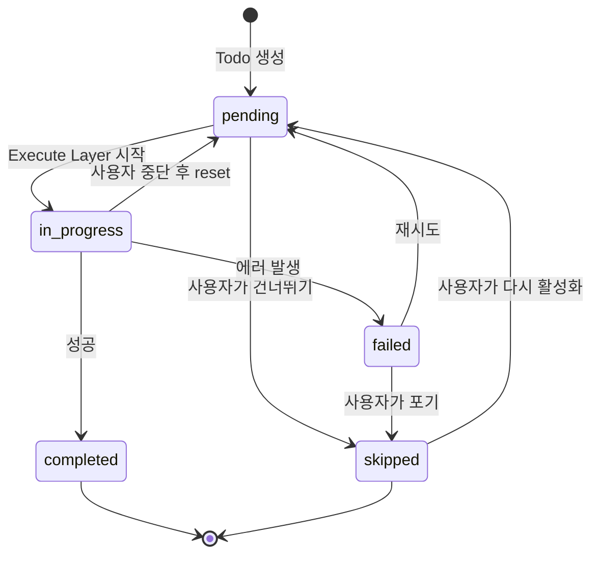

# Todo State Management - 상태 머신 설계

**작성일:** 2025-11-06
**버전:** 1.0
**목적**: 단순하게 시작하되, 확장 가능한 Todo 상태 관리 시스템 설계

---

## 📋 목차

1. [설계 원칙](#설계-원칙)
2. [Phase 1: 기본 사용자 개입 (현재 구현)](#phase-1-기본-사용자-개입)
3. [Phase 2: 상태 전이 규칙 (추후 확장)](#phase-2-상태-전이-규칙)
4. [Phase 3: 고급 기능 (장기 확장)](#phase-3-고급-기능)
5. [구현 가이드](#구현-가이드)

---

## 🎯 설계 원칙

### 핵심 원칙

1. **단순 시작 (Simple Start)**
   - Phase 1은 최소 기능만 구현
   - 복잡한 로직 없이 기본 동작부터

2. **확장 가능성 (Extensibility)**
   - 아키텍처에 확장 지점 확보
   - Phase 2, 3로 점진적 확장 가능

3. **사용자 중심 (User Control)**
   - 사용자가 언제든 개입 가능
   - 사용자가 모든 것을 변경 가능

4. **유연한 저장 방식 (Flexible Storage)**
   - **Phase 1**: State 기반 (`state["todos"]`)
     - 간단하고 Checkpointing 자동 적용
     - 대부분 케이스에 충분 (Todo 10-50개)
   - **Phase 2+**: 필요시 DB 확장
     - Todo 100개 이상이면 PostgreSQL 테이블로 이동
     - 하이브리드 방식 지원 가능
   - **확장성**: Phase 1에서 간단하게 시작, 성능 필요시 확장

---

## 📦 Phase 1: 기본 사용자 개입 (현재 구현)

### 목표

**"사용자가 언제든 개입하고 변경할 수 있다"**

### Todo 구조

```python
{
  "id": "uuid",              # 고유 ID
  "task": "칼로리 계산",      # 작업 내용
  "agent": "DietAgent",       # 담당 Agent
  "status": "pending",        # 상태
  "step": 1,                  # 순서
  "created_at": "...",        # 생성 시각
  "updated_at": "...",        # 수정 시각

  # Phase 1: 기본 필드
  "description": "...",       # 상세 설명 (optional)
  "priority": "normal",       # 우선순위 (optional)
  "retry_count": 0,           # 재시도 횟수
  "error": null,              # 에러 정보

  # Phase 2+: 확장 필드 (나중에 추가)
  # "dependencies": [],       # 의존성 (Phase 2)
  # "parallel_group": null,   # 병렬 실행 그룹 (Phase 3)
  # "timeout": 300,           # 타임아웃 (Phase 2)
}
```

### Status 값 (Phase 1)

```python
TodoStatus = Literal[
    "pending",      # 대기 중 (기본값)
    "in_progress",  # 실행 중
    "completed",    # 완료
    "failed",       # 실패
    "skipped",      # 사용자가 건너뜀
]
```

**의미**:
- `pending`: Todo가 생성되었으나 아직 실행 안 됨
- `in_progress`: Execute Layer에서 현재 실행 중
- `completed`: 성공적으로 완료
- `failed`: 실행 중 에러 발생
- `skipped`: 사용자가 의도적으로 건너뜀

### 사용자 개입 시나리오

#### 시나리오 1: 실행 중 중단
```
1. Agent가 Todo 3번 실행 중
2. 사용자: "중단" 버튼 클릭
3. 시스템: state["requires_approval"] = True 설정
4. 그래프 interrupt()
5. 사용자: Todo 리스트 검토
6. 사용자: 4번 삭제, 5번 수정
7. 사용자: "계속" 클릭
8. 시스템: 수정된 Todo로 재개
```

#### 시나리오 2: Todo 직접 수정
```
1. 사용자: PUT /api/sessions/{thread_id}/todos API 호출
2. 시스템: state["todos"] 업데이트
3. 시스템: state["user_interactions"] 기록
4. 시스템: state["user_requested_todo_update"] = True
5. 다음 실행 시: Todo Manager 호출되어 새 Todo 반영
```

#### 시나리오 3: 개입 지점 설정
```
1. Cognitive Layer: 계획 생성 후 승인 요청
   - state["requires_approval"] = True
   - state["approval_reason"] = "plan_created"
2. 그래프 interrupt()
3. 사용자: 계획 검토 → 승인 또는 수정
4. 사용자가 수정하면:
   - PUT /api/sessions/{thread_id}/state 호출
   - state["plan"] 직접 수정
   - state["user_interactions"] 기록
5. POST /api/sessions/{thread_id}/resume 호출
```

### 상태 전이 (Phase 1)



**중요**: Phase 1에서는 **전이 규칙 강제 없음**
- 사용자가 API로 status를 어떤 값이든 변경 가능
- 시스템은 제안만 하고, 사용자가 최종 결정

### State 관리 방식

```python
# State에서 Todos 관리
state["todos"] = [
    {"id": "1", "task": "A", "status": "completed", "step": 1},
    {"id": "2", "task": "B", "status": "in_progress", "step": 2},
    {"id": "3", "task": "C", "status": "pending", "step": 3},
]

# 사용자 개입 기록
state["user_interactions"] = [
    {
        "type": "modify_todo",
        "timestamp": "2025-11-06T10:30:00",
        "details": {
            "action": "delete",
            "todo_id": "2"
        }
    },
    {
        "type": "interrupt",
        "timestamp": "2025-11-06T10:29:50",
        "reason": "user_requested"
    }
]
```

### API 구조 (Phase 1)

```python
# Todo 추가
POST /api/sessions/{thread_id}/todos
{
  "task": "새 작업",
  "agent": "DietAgent",
  "description": "...",
  "priority": "high"
}

# Todo 삭제
DELETE /api/sessions/{thread_id}/todos/{todo_id}

# Todo 수정
PUT /api/sessions/{thread_id}/todos/{todo_id}
{
  "status": "skipped",  # 사용자가 자유롭게 변경
  "task": "수정된 작업",
  "agent": "WorkoutAgent"
}

# Todo 순서 변경
PUT /api/sessions/{thread_id}/todos/reorder
{
  "order": ["3", "1", "2"]  # todo_id 순서
}

# 중단
POST /api/sessions/{thread_id}/interrupt
{
  "reason": "user_review_needed"
}

# 재개
POST /api/sessions/{thread_id}/resume
{
  "approve": true
}

# 재시도
POST /api/sessions/{thread_id}/retry/{todo_id}
```

### 확장 지점 (Phase 1에서 준비)

Phase 1 구현 시 다음을 고려하여 확장 가능하게 설계:

1. **Todo 구조**:
   - Dict 형태로 유연하게 (새 필드 추가 쉬움)
   - `metadata` 필드 예약 (Phase 2+ 확장용)

2. **Status 전이**:
   - Phase 1: 검증 없음 (사용자 자유)
   - Phase 2: 검증 함수 추가 가능 (`validate_status_transition`)

3. **실행 로직**:
   - Phase 1: 순차 실행만
   - Phase 2: 의존성 확인 함수 추가
   - Phase 3: 병렬 실행 로직 추가

---

## 🔄 Phase 2: 상태 전이 규칙 (추후 확장)

### 목표

**"상태 전이 규칙 추가하여 안정성 향상"**

### 추가 기능

#### 1. 상태 전이 검증

```python
def validate_status_transition(
    from_status: str,
    to_status: str,
    allow_user_override: bool = True
) -> bool:
    """
    상태 전이 가능 여부 검증

    Args:
        from_status: 현재 상태
        to_status: 변경하려는 상태
        allow_user_override: 사용자 개입 시 규칙 무시

    Returns:
        전이 가능 여부
    """
    # 사용자가 직접 변경하면 모든 전이 허용
    if allow_user_override:
        return True

    # 시스템 자동 전이는 규칙 적용
    valid_transitions = {
        "pending": ["in_progress", "skipped"],
        "in_progress": ["completed", "failed", "pending"],
        "failed": ["pending", "skipped"],
        "completed": [],
        "skipped": ["pending"]
    }

    return to_status in valid_transitions.get(from_status, [])
```

#### 2. 의존성 관리

```python
# Todo에 dependencies 필드 추가
{
  "id": "3",
  "task": "메뉴 추천",
  "status": "pending",
  "dependencies": ["1", "2"],  # Todo 1, 2 완료 후 실행
}

def can_execute_todo(todo: Dict, all_todos: List[Dict]) -> bool:
    """
    Todo 실행 가능 여부 확인 (의존성 체크)
    """
    if not todo.get("dependencies"):
        return True

    for dep_id in todo["dependencies"]:
        dep_todo = next((t for t in all_todos if t["id"] == dep_id), None)
        if not dep_todo or dep_todo["status"] != "completed":
            return False

    return True
```

#### 3. 타임아웃 처리

```python
{
  "id": "4",
  "task": "API 호출",
  "timeout": 300,  # 5분 제한
  "started_at": "2025-11-06T10:30:00"
}

# Execute Layer에서 타임아웃 확인
if (datetime.now() - todo["started_at"]).seconds > todo["timeout"]:
    todo["status"] = "failed"
    todo["error"] = "timeout"
```

### 확장 지점 (Phase 2)

1. **커스텀 전이 규칙**:
   - 사용자가 전이 규칙 설정 가능
   - `state["transition_rules"]` 추가

2. **조건부 실행**:
   - Todo에 `condition` 필드 추가
   - 조건 만족 시에만 실행

---

## 🚀 Phase 3: 고급 기능 (장기 확장)

### 목표

**"복잡한 워크플로우 지원"**

### 추가 기능

#### 1. 병렬 실행

```python
{
  "id": "5",
  "task": "칼로리 계산",
  "parallel_group": "group_1",  # 같은 그룹은 병렬 실행
}

{
  "id": "6",
  "task": "영양소 분석",
  "parallel_group": "group_1",  # 5번과 동시 실행
}
```

#### 2. 조건부 분기

```python
{
  "id": "7",
  "task": "BMI 계산 후 분기",
  "on_success": {
    "if": "result['bmi'] > 25",
    "then": ["8"],  # 다이어트 플랜
    "else": ["9"]   # 유지 플랜
  }
}
```

#### 3. 롤백 처리

```python
{
  "id": "10",
  "task": "데이터 저장",
  "rollback_on_error": true,
  "rollback_todos": ["8", "9"]  # 실패 시 8, 9 롤백
}
```

---

## 💻 구현 가이드

### Phase 1 구현 체크리스트

#### State 구조

```python
class OctostratorState(TypedDict):
    # 기본 (기존)
    user_query: str
    session_id: str
    todos: Annotated[List[Dict], merge_todos_smart]

    # Phase 1 추가
    user_interactions: Annotated[List[Dict], track_user_interactions]

    # Phase 2+ 예약 (아직 사용 안 함)
    # transition_rules: Optional[Dict]  # 상태 전이 규칙
    # todo_dependencies: Optional[Dict]  # 의존성 그래프
```

#### Todo Reducer (merge_todos_smart)

```python
def merge_todos_smart(
    existing: Optional[List[Dict]],
    new: List[Dict]
) -> List[Dict]:
    """
    Phase 1: 기본 병합 로직
    Phase 2+: 의존성 검증, 전이 규칙 적용 추가 가능
    """
    if existing is None:
        existing = []

    todo_dict = {}
    for todo in existing:
        if todo.get("id"):
            todo_dict[todo["id"]] = todo.copy()

    # 새 Todo 처리
    for todo in new:
        if "id" not in todo:
            todo["id"] = str(uuid.uuid4())

        # Phase 1: 기본 필드만 설정
        if "status" not in todo:
            todo["status"] = "pending"
        if "retry_count" not in todo:
            todo["retry_count"] = 0

        # Phase 2+: 의존성 검증 (추후 추가)
        # if "dependencies" in todo:
        #     validate_dependencies(todo, todo_dict)

        todo_id = todo["id"]
        if todo_id in todo_dict:
            # 업데이트
            merged = todo_dict[todo_id].copy()
            merged.update(todo)
            merged["updated_at"] = datetime.now().isoformat()

            # Phase 2+: 상태 전이 검증 (추후 추가)
            # old_status = todo_dict[todo_id]["status"]
            # new_status = merged["status"]
            # if not validate_status_transition(old_status, new_status):
            #     merged["status"] = old_status  # 롤백

            todo_dict[todo_id] = merged
        else:
            # 신규 생성
            todo["created_at"] = datetime.now().isoformat()
            todo["updated_at"] = datetime.now().isoformat()
            todo_dict[todo_id] = todo

    result = list(todo_dict.values())
    result.sort(key=lambda x: x.get("step", 999))
    return result
```

#### Execute Layer 수정

```python
async def execute_layer_node(state: OctostratorState) -> OctostratorState:
    """
    Todo 순차 실행

    Phase 1: 순차 실행만
    Phase 2: 의존성 확인
    Phase 3: 병렬 실행
    """
    todos = state.get("todos", [])

    for todo in todos:
        # Phase 1: 기본 상태 확인만
        if todo["status"] != "pending":
            continue

        # Phase 2: 의존성 확인 (추후 추가)
        # if not can_execute_todo(todo, todos):
        #     continue

        # Phase 3: 병렬 그룹 확인 (추후 추가)
        # if todo.get("parallel_group"):
        #     await execute_parallel_group(...)

        # 실행
        todo["status"] = "in_progress"
        state["todos"] = [todo]  # 업데이트

        try:
            # Agent 실행
            agent = get_agent(todo["agent"])
            result = await agent.execute(todo["task"])

            todo["status"] = "completed"
            todo["result"] = result
        except Exception as e:
            todo["status"] = "failed"
            todo["error"] = str(e)
            todo["retry_count"] += 1

            # Phase 1: 재시도 정책 (기본)
            retry_policy = state.get("context", {}).get("retry_policy", {})
            if retry_policy.get("enabled", False):
                if todo["retry_count"] < retry_policy.get("max_attempts", 3):
                    todo["status"] = "pending"  # 재시도

        # 업데이트
        state["todos"] = [todo]

        # Action history 기록
        state["action_history"] = [{
            "action": "execute_todo",
            "todo_id": todo["id"],
            "status": todo["status"],
            "retry_count": todo["retry_count"]
        }]

    return state
```

### 확장성 확인 체크리스트

- [ ] Todo 구조가 Dict 형태 (새 필드 추가 쉬움)
- [ ] Reducer 함수에 주석으로 Phase 2+ 확장 지점 표시
- [ ] Execute Layer에 조건부 로직 추가 가능한 구조
- [ ] State에 예약 필드 주석 처리
- [ ] API가 RESTful하여 새 엔드포인트 추가 쉬움

---

## 📊 Phase별 기능 요약

| 기능 | Phase 1 | Phase 2 | Phase 3 |
|------|---------|---------|---------|
| 기본 status | ✅ | ✅ | ✅ |
| 사용자 개입 | ✅ | ✅ | ✅ |
| 순차 실행 | ✅ | ✅ | ✅ |
| 재시도 (기본) | ✅ | ✅ | ✅ |
| 상태 전이 규칙 | ❌ | ✅ | ✅ |
| 의존성 관리 | ❌ | ✅ | ✅ |
| 타임아웃 | ❌ | ✅ | ✅ |
| 병렬 실행 | ❌ | ❌ | ✅ |
| 조건부 분기 | ❌ | ❌ | ✅ |
| 롤백 | ❌ | ❌ | ✅ |

---

## ✅ 결론

### Phase 1 범위 (현재 구현)

**목표**: 사용자 개입 중심의 단순하고 유연한 시스템

**구현 사항**:
1. ✅ 기본 Todo 구조 (id, task, agent, status, step)
2. ✅ 5가지 status (pending, in_progress, completed, failed, skipped)
3. ✅ 사용자가 자유롭게 변경 가능 (API)
4. ✅ 중단/재개 기능
5. ✅ 재시도 기본 지원
6. ✅ 확장 가능한 아키텍처

**확장 준비**:
- Dict 구조로 유연성 확보
- 주석으로 Phase 2+ 확장 지점 표시
- 검증 로직 추가 가능한 구조

### 다음 단계

1. ✅ 이 설계서 검토
2. Phase 1 구현 시작
3. Phase 2, 3는 필요 시 점진적 확장

---

**참고 문서**:
- `PLAN_251106.md` - 전체 계획
- `IMPLEMENTATION_STEPS_251106.md` - 구현 가이드
- `STATE_DESIGN_251106.md` - State 구조
